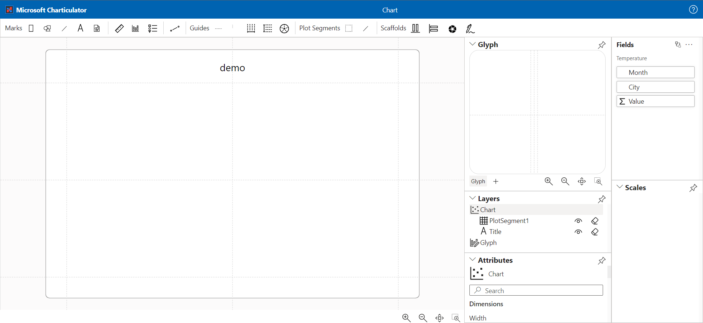

Since the version of Charticulator from Microsoft is retiring, I decided to deploy to [GitHub Pages](https://zbritva.github.io/charticulator/) the latest version with fixes and some new functionality. Unfortunately all this new stuff is not included in the Power BI Visual. In the next 2 months I plan to prepare alternative versions of visuals.

The first stage is practically accomplished. In which I upgrade the UI library to Fluent UI 9. Since the first version doesn't work with React 18+ fully.

The upcoming work is fixing critical bugs in the current version of the visual, which block the implementation of the full cycle of chart development in the Power BI report.