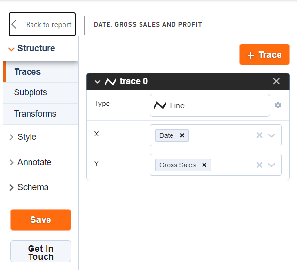
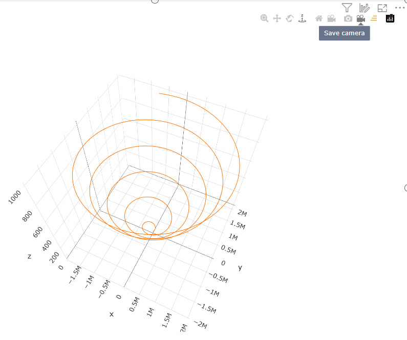
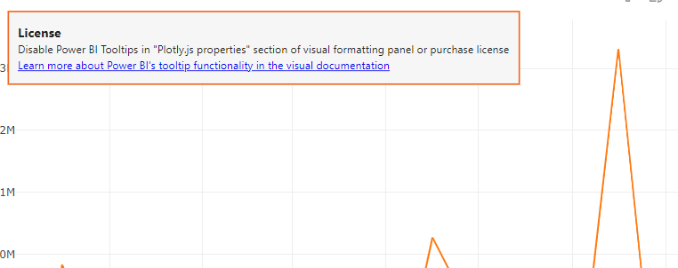
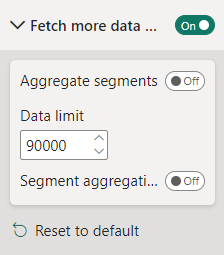
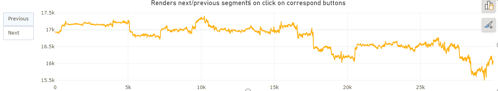

# PlotlJS Visual by Akvelon

The 1.7.2 update for PlotlJS Visual by Akvelon was released today. Here I want to tell you about some small but important changes.

## Internal refactoring the code of the visual

The first version was developed in a short time within 2 weeks. Since the idea was just to connect Chart Studio and Plotly.js visualization library, the internal code was very hard to read. The useState provided by the React library was used for state management, and [changes passed by Power BI to the `update`](https://learn.microsoft.com/en-us/power-bi/developer/visuals/power-bi-visuals-concept) function were pushed to React internally via [`forwardRef`](https://react.dev/reference/react/forwardRef).

In version 1.7.2, the Redux Toolkit was added for state management, making the code much easier to understand and maintain

## Save button moved to left panel

The "Save" button has been moved to the left panel next to the "Get In Touch" button. Initially, after making changes through the visual editor, it was always necessary to go to the text editor to save the changes



## Button to save current position of camera

The "Save camera" button has been added to copy current camera coodinates into JSON schema.



This makes it faster and easier to set coordinates for the camera, and the camera does not return to the default position when rendering of the visual afterward 

## License error notification banner added

A notification banner with a description was added to provide a link to a paid visualization feature.

You can remove the banner by turning off the paid functionality in the viewer's settings (Settings => Plotly.js properties => Power BI tooltips) or by [purchasing a subscription](https://appsource.microsoft.com/en-us/marketplace/checkout/akvelon.plotlyjsvisualbyakvelon?tab=Overview) on Microsoft Office 365 page.



You buy the functionality of Power BI tooltips, while the visual itself is free.

You must purchase a license for each user of the report, regardless of the role (report author or consumer).

At the moment there are only 2 subscription options for now: 

* Annual plan
* Monthly plan

The paid feature is available to everyone in the following environments:

* Embedded - Publish To Web, PaaS embed
* National/Regional clouds (Depends on general support for transactability in national/regional clouds)
* RS Server
* Exporting (PDF\PPT) using REST API 

## Add loading segments by 30k rows instead loading all data per update

Visuals by default support visualization of a thousand data points. But this can be changed in the settings by the developer to load thirty thousand data points.

But if even that isn't enough, Power BI provides a [Fetch more data API](https://learn.microsoft.com/en-us/power-bi/developer/visuals/fetch-more-data) for visuals that allows you to download more data (but no more than 100MB).

Power BI can provide data:

* All at once, each time increasing the data portion by thirty thousand (30k, 60k, 90k e.t.c.).
* By segments, shifting window of 30k data points


The first approach was already supported by this visual, starting with this version the second option is also supported

To use the new features, set the following settings:



And add buttons to shift the segments into `layout` settings of JSON schema:

```json
{
  "layout": {
    "updatemenus": [
      {
        "buttons": [
          {
            "args": [
              {
                "aggregateSegments": false
              }
            ],
            "label": "Previous",
            "method": "loadPrevSegment",
            "name": "loadPrevSegment"
          },
          {
            "args": [
              {
                "aggregateSegments": false
              }
            ],
            "label": "Next",
            "method": "loadNextSegment",
            "name": "loadNextSegment"
          }
        ],
        "type": "buttons"
      }
    ]
  }
}
```

Example of a chart with buttons to shift segments:



 
