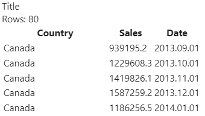
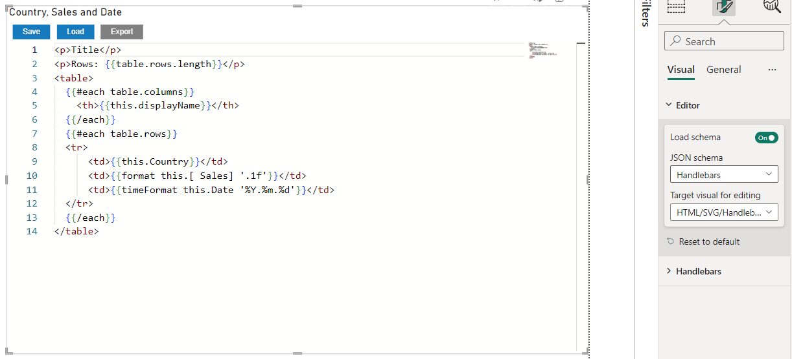

# HTML/SVG/Handlebars Visual

Here's a brief description of what I want to offer to the Power BI community. There may be a need for a visual that would allow the use of HTML and SVG to layout content in Power BI reports using data from Power BI. Yes, Appsource already has visuals that offer these solutions. But all of them load HTML content through data.

The video shows the process of using two visual objects to create a simple table.

<iframe width="560" height="315" src="https://www.youtube.com/embed/QpSfZvts_FE?si=T3rcsc328fOYFZbi" title="HTML/SVG/Handlebars Visual demo on YouTube" frameborder="0" allow="accelerometer; autoplay; clipboard-write; encrypted-media; gyroscope; picture-in-picture; web-share" allowfullscreen></iframe>

The idea is very simple, I already have a visual that has the Monaco editor built in, with syntax highlighting and autocomplete. The second visual will display the [handlebarsjs](https://handlebarsjs.com/) template, which is created using the editor. The templateizer allows you use [handlebars expressions](https://handlebarsjs.com/guide/#what-is-handlebars) to use the data in the resulting output.

Example Handlebars expression

`<p>{{there can be Power BI data}}</p>`

gives us an HTML paragraph element with data from Power BI.

In the video, I use another example similar to the following one:

```html
<p>Title</p>
<p>Rows: {{table.rows.length}}</p>
<table>
  {{#each table.columns}}
    <th>{{this.displayName}}</th>
  {{/each}}
  {{#each table.rows}}
    <tr>
		<td>{{this.Country}}</td>
        <td>{{this.[ Sales]}}</td>
        <td>{{this.Date}}</td>
	 </tr>
  {{/each}}
</table>
```

The `table` object contains data in the form of a table passed from Power BI to visual.

I use the `{{table.rows.length}}` expression to get the number of rows. In the output, instead of `{{{table.rows.length}}`, the templating engine outputs the value. And it is dynamic, it updates the value when the data changes.

Handlebarsjs has [custom helpers](https://handlebarsjs.com/guide/#custom-helpers) that allows developers provide custom functionality. I used it to provide [D3.js formatting features](https://d3js.org/d3-format).

You can use `format` and `timeFormat` functions to formad numbers and date.

```html
<tr>
    <td>{{this.Country}}</td>
    <td>{{format this.[ Sales] '.1f'}}</td>
    <td>{{timeFormat this.Date '%Y.%m.%d'}}</td>
</tr>
```

Output of template:



Try it for yourself:

[Power BI Visual Editor](./powerBIEditorVisual.1.0.3.0.pbiviz)

[HTML/SVG/Handlebars Visual](./handlebarsVisual.1.0.0.0.pbiviz)

HTML/SVG/Handlebars Visual is not 100% ready, there is no error output in the UI, to understand what is wrong you need to use browser DevTools if your template is not working.

Don't forget swtich the target visual and schema for Power BI Visual Editor:



I'm currently experimenting with adding functions from D3.js, such as scale and axes.

Would love to hear your opinion, you can connect with me on [LinkedIn](https://www.linkedin.com/in/ilfat-galiev/)