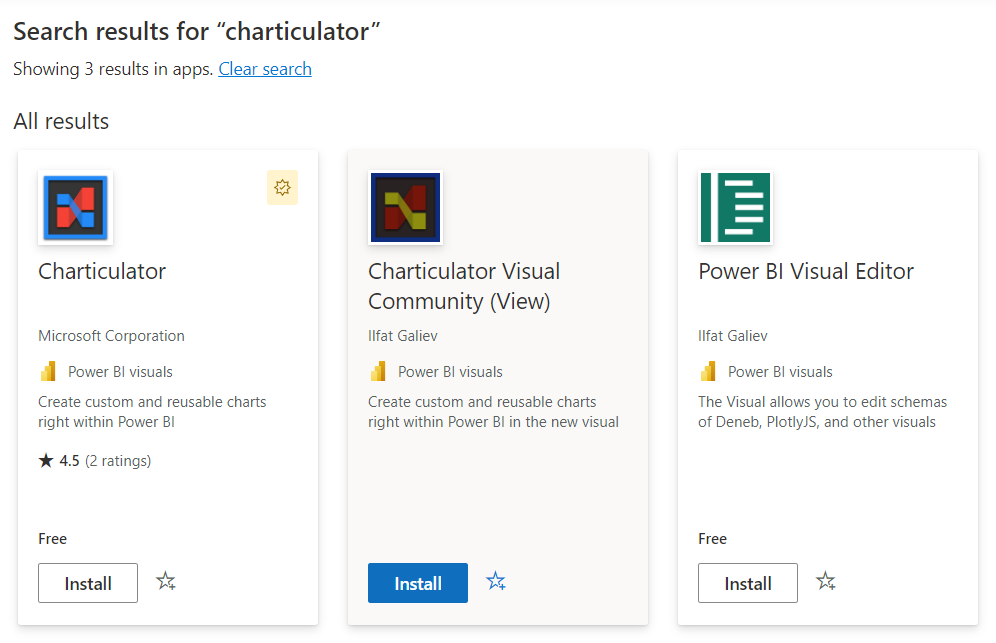
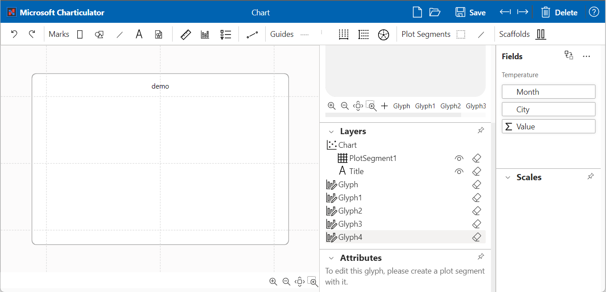
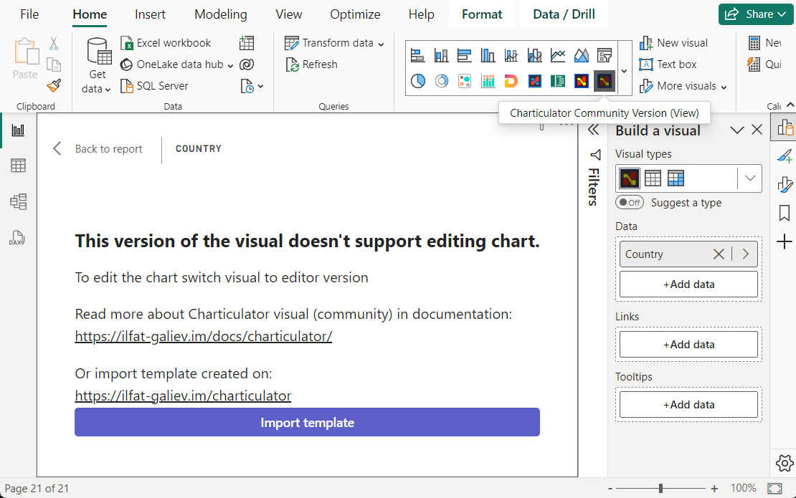
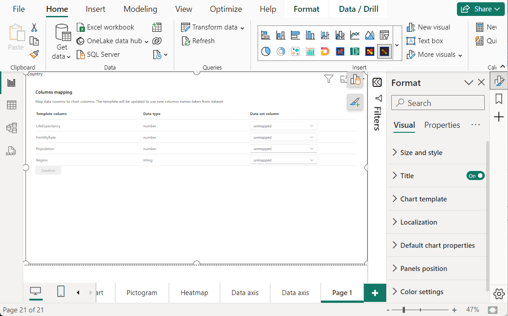
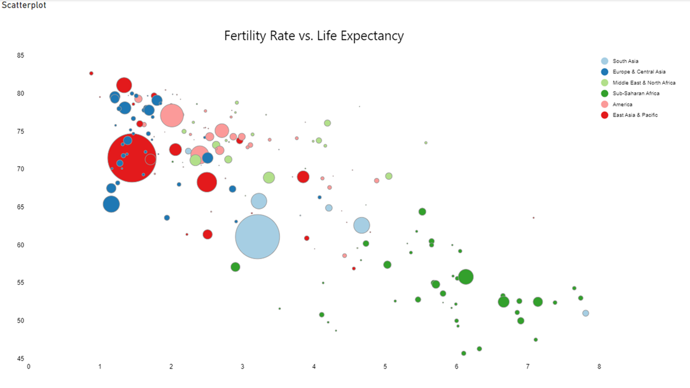
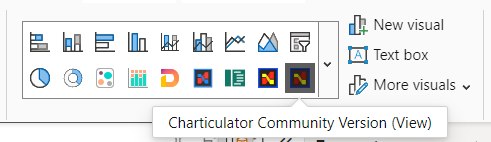

# Charticulator Visual (View)

The first version of the visual for rendering Charticulator templates has been published in [AppSource](https://appsource.microsoft.com/en-us/product/power-bi-visuals/ilfatgaliev1696579877540.charticulator_visual_community_view) 

The editor version of the visual available on [GitHub repository page](https://github.com/zBritva/charticulator-visual-community/tree/master/charticulator-visual/docs) or by [direct link](charticulatorVisualCommunity_EDITOR.1.0.5.0.pbiviz)

## Getting started

To use the visual, you need to create a new chart using either the old Charticulator or a visual with an editor, or import a template that you have (or took from https://charticulator.com/gallery/index.html). 

You also can use [The New Charticulator App](https://ilfat-galiev.im/charticulator/) to create chart templates.

it's not recommend to use [Old Charticulator App](https://charticulator.com/app/index.html) because it doesn't include new features and bug fixes.

To import the template, create instance of the new visual, assign data from Power BI and switch the visual to edit mode by click on "Edit" on visual menu. You should see button to import the template, click on it and select template file. The visual saves the template in settings immediately.

Click on "Back to report" to exit from edit mode.

The visual shows the chart built from template if the visual has all data for template, otherwise it requires to provide columns mapping between data columns and template columns. In this case set column mappings and confirm by clicking on "Confirm".

After that visual should show the chart built from template and data assigned from Power BI.

To build the chart from scratch, create instance of the visual and assign data, then switch the visual to old Charticulator visual or to the new Charticulator with editor.

After that click on "Edit" in visual menu to switch the visual to editor mode, it launches the Charticulator App for plotting new chart. 

Save the chart and close editor by click on "Back to report", the editor version of the visual will show preview version of chart.

To save the chart switch back to the view version of the visual and save a report. The visual with editor will not work in Power BI services in view mode of the report.

# Next steps

If you have an idea or suggestions, feel free to open a [discussion on the GitHub repository page](https://github.com/zBritva/charticulator-visual-community/discussions)

