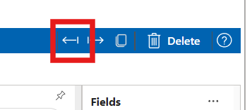

### Power BI Certification

The [Charticulator Visual Community (View)](https://appsource.microsoft.com/en-us/product/power-bi-visuals/ilfatgaliev1696579877540.charticulator_visual_community_view?tab=Overview) has passed [the certification](https://learn.microsoft.com/en-us/power-bi/developer/visuals/power-bi-custom-visuals-certified) and will be available for end users in 2-3 weeks.

### Popup toast notification

The [Charticulator Visual Community (Editor)](https://appsource.microsoft.com/en-us/product/power-bi-visuals/ilfatgaliev1696579877540.charticulator_visual_community_editor?tab=Overview) shows notification in toast when chat saves in visual settings.

### Scale editor popup

Issue with scale editor popup on click on scale has been partially fixed. When user clicks on scale name on Scales list panel editor opens Scale editor.

## Columns highlight fixed partially

The visual passed highlight columns correctly. Highlight controls was added into visual settings.

The visual enabled the highlight settings for editor if template contains highlight columns.

TODO: need to implement case when highlight disabled and visual doesn't filter category values.

## Attribute panel

Attribute panel has border lines for each  group of properties.

## Fixing issue with sorting axes data in plot segment

The sorting axis value by another colum works now

## Importing chat templates fixed

The visual supports importing templates in edit mode.

## Bind data button icon

The icons of data binding button has been fixed

## Chart attributes search

The issue, when chart attributes doesn't filters properly, has been fixed

## Dataset and Glyph/Attributes panels are collapsible

It brings more space for editing the chart.
Data can be bind to properties on Attributes panel. It's not necessary to have Dataset panel always visible

## Downloads

You can download the latest development version in Visuals menu of blog

