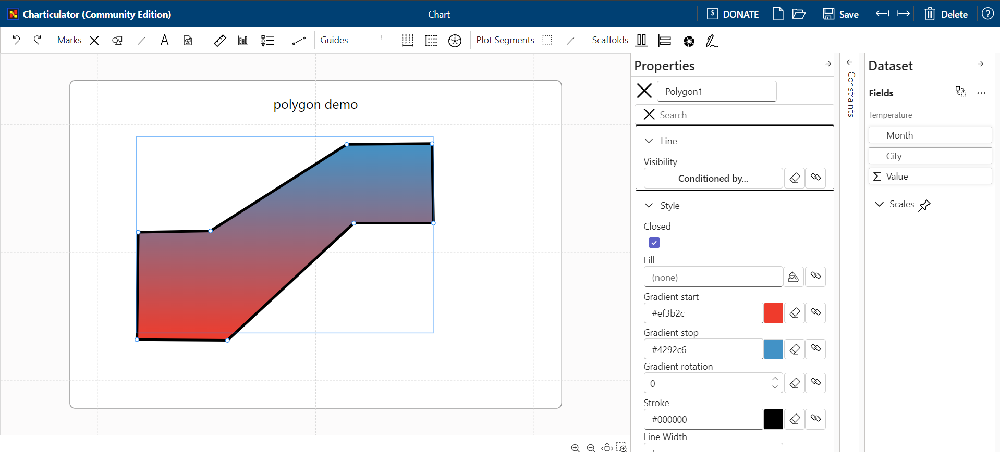

### The new feature for Charticulator

This is one of the most significant updates for Charticulator. The mark allows to draw arbitrary shape for data visualization. The polygon support snapping to other marks or parent objects and supports basic styling like rectangle, ellipsis or triangle marks.

The mark doesn't have a icon yet. But already available for testing in application on [https://ilfat-galiev.im/charticulator/](https://ilfat-galiev.im/charticulator/) page.

Current limitations:

* The mark doesn't have internal constraints (no middle points like in line mark)
* Rendering in polar coordinates has not implemented yet
