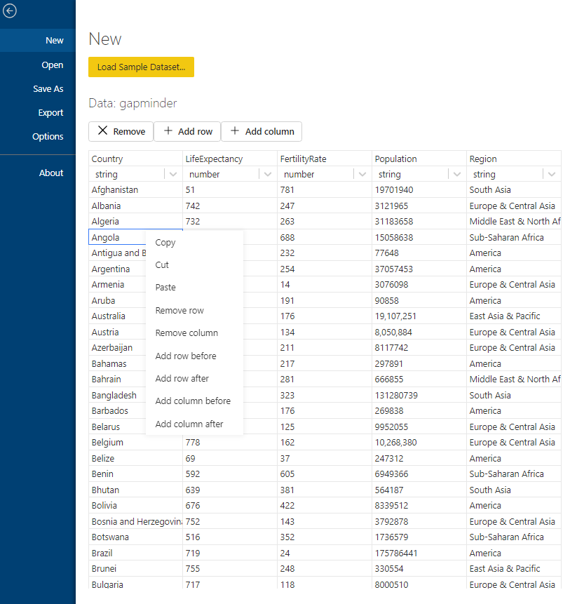
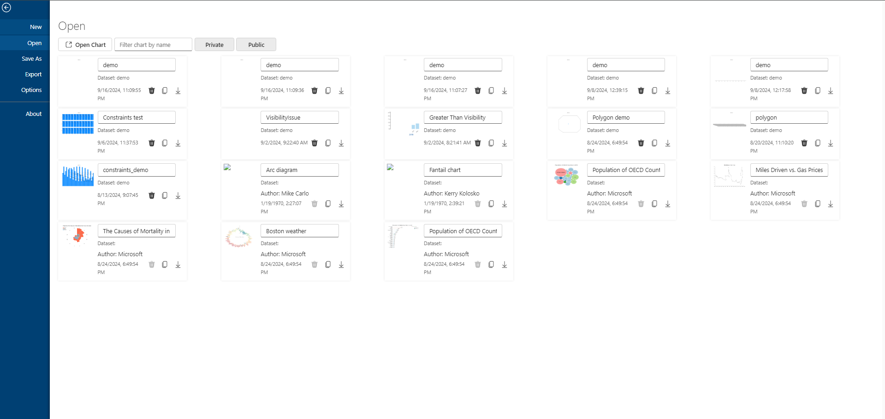

The [Charticulator App](https://ilfat-galiev.im/charticulator/) can allow to import data from *.csv files, but there is no opportunities to pre edit, ender or edit data on chart development phase.

### Charticulator data editor

The [PR48](https://github.com/zBritva/charticulator/pull/48) closes this gap. Powered by [ReactGrid component](https://reactgrid.com/) brings feature to edit current data, creating table from scratch, inserting rows and columns.

### Wide view

The layout of current charts are changed from vertical list to grid to display private and publicly available charts.

On [PR48](https://github.com/zBritva/charticulator/pull/48) page you can find link to deployment of the latest development branch.
 