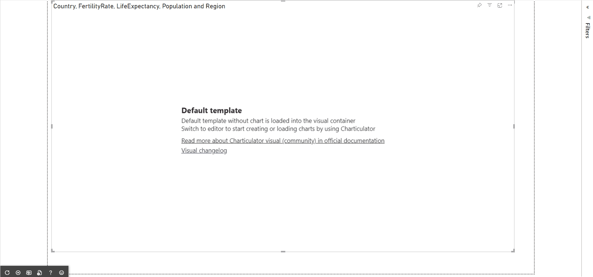

The next version of the Editor visual (1.3.0.0) will support importing pre build charts and templates from public source.

On importing chart the visual imports data and rewrites current data passed from Power BI.

Then on saving imported chart the visual opens mapping view to map chart columns to current data passed from Power BI.

On importing template the visual opens data mapping view to map current data passed from Power BI to template columns.
