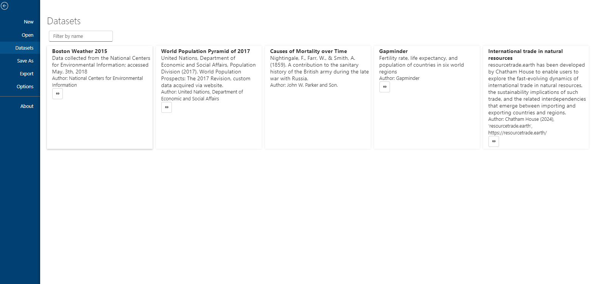

The Charticulator application has a new dataset list that allows you to import datasets with a single click to create a chart from scratch.

The chart list view also supports quick filtering of datasets by name.

If you want to see data samples on list, contact with me. But make sure that dataset is allowed to copy and using doesn't breaks laws or agreements.
