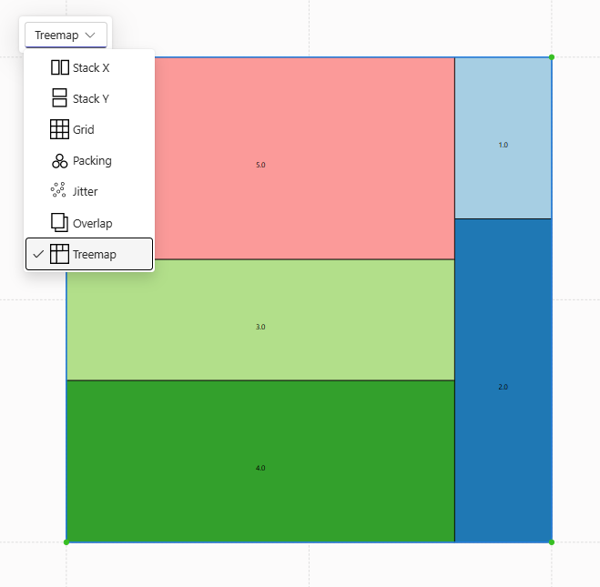
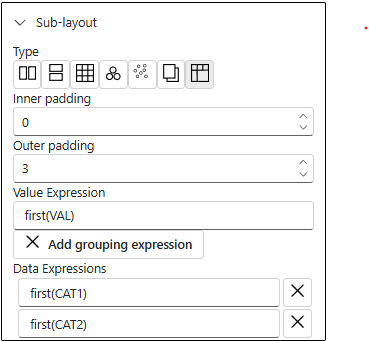

# Treemap sub-layout

The Charticulator is going to get new Treemap sub-layout for cartesian Plot Segment in the next version [1.5.0.0](/docs/charticulator/changelog#1500) of the visual.

The sub-layout has Inner padding, Outer padding, attributes to configure visual appearance.

Value Expression sets values for nodes.

Data Expressions set grouping of data by given columns.

The feature powered by [D3.js library](https://d3js.org/d3-hierarchy/treemap)

The Charticulator binds glyphs to tree leaves.
