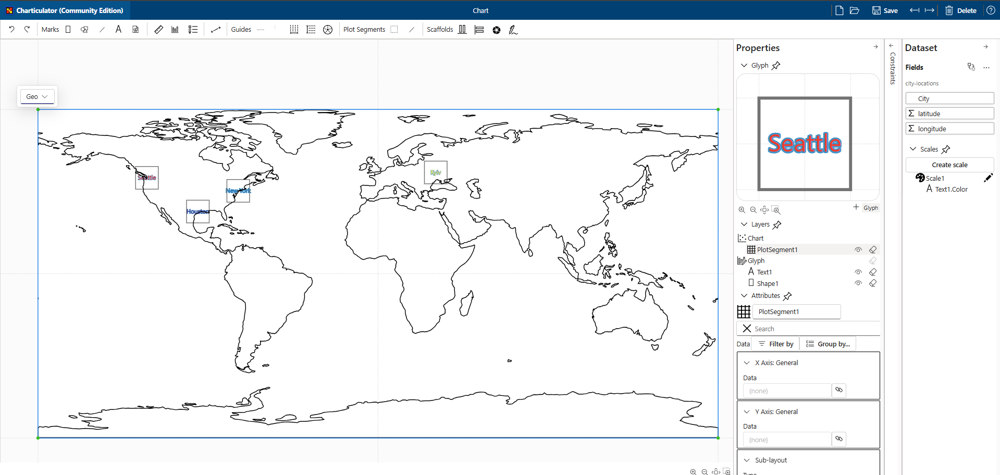
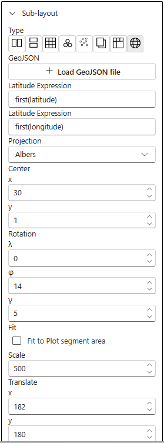

# GeoJSON

GeoJSON is a format for encoding a variety of geographic data structures.

```geojson
{
  "type": "Feature",
  "geometry": {
    "type": "Point",
    "coordinates": [125.6, 10.1]
  },
  "properties": {
    "name": "Dinagat Islands"
  }
}
```

The Charticulator has sub-layout features that allow to authors arrange Glyphs on Plot Segments.

Usually Charticulator uses x or y axes to determine positions of each Glyph.

Sub-layouts is one approach to integrate third party layouts like [d3-geo](https://d3js.org/d3-geo), [d3-hierarchy/tree](https://d3js.org/d3-hierarchy/tree), [d3-hierarchy/pack](https://d3js.org/d3-hierarchy/pack) e.t.c.



The d3-geo package uses to render GeoJSON into SVG path as part of Plot Segment and positioning Glyphs by given latitude, longitude column bindings.



Geo sub-layout has properties to load GeoJSON file, to specify expression for geo coordinate columns, projections, center of map, rotations, scale and translates rendering SVG on Plot Segment.
