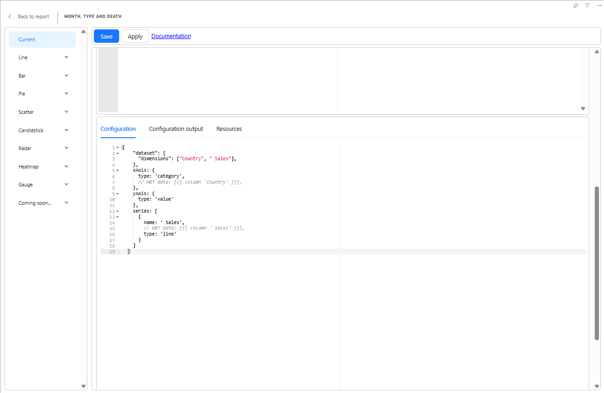

### ✨ Charticulator Updates

I've made several improvements to the **Charticulator** custom visual for Power BI:

- ✅ **Unified** the behavior of the *Import Template* and *Open Chart* actions.
- 🛠️ **Fixed** an issue where the visual wouldn't load a template into the editor if chart columns were not mapped.
- 🎨 **Power BI Theme Support**: The editor now respects the Power BI Desktop **dark theme** (Preview feature).
- 🧹 **New Feature**: Added a convenient button for deleting scales directly from the scales panel.
- 🎯 **Bug Fix**: The visual now correctly applies Power BI theme colors when rendering.

---

### 📌 Apache ECharts Visual

Minor but useful updates for the **Apache ECharts** visual:

- 🧩 The built-in editor layout has been updated—**Save** and **Apply** buttons are now pinned to the top of the viewport for better accessibility.

  

- 📊 The visual now supports [**D3.js formatting options**](/docs/echarts-visual) for enhanced data presentation flexibility.
