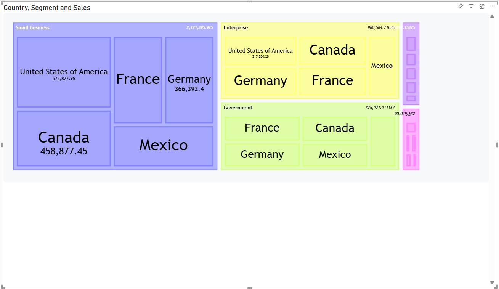

Exciting News! Treemap Diagrams Now Available in Mermaid Chart Visuals for Power BI 📊

I have just rolled out an update to Mermaid Chart Visuals for Power BI The amazing developers at Mermaid have introduced a powerful new diagram type, the Treemap.

## What are Treemap diagrams?

For those new to them, Treemap diagrams are way to visualize hierarchical data. A set of nested rectangles where the size of each rectangle is proportional to its value. This makes it incredibly easy to see which categories are the most significant.

## Dynamic Data Binding with Handlebars.js

To make this even more powerful, the new visual leverages Handlebars.js for data binding. This allows you to use templating to dynamically generate the Treemap syntax directly from your Power BI data. Instead of manually writing out the hierarchy, you can create a template that automatically builds the diagram based on the fields and measures in your dataset, making your reports fully interactive and data-driven.

Code sample:

````
{{ var 'cat1' (map 'Country' table.rows) }}
{{ var 'cat2' (map 'Segment' table.rows) }}
{{ var 'measure1' (map 'Sales' table.rows) }}
{{ scaleBand 'Category1' (val 'cat1') (val 'cat1')}}
{{ scaleBand 'Category2' (val 'cat2') (val 'cat2')}}
{{ scaleBand 'Measure1' (val 'cat2') (val 'measure1')}}

````

Result:



The source code may seem complex, but I'm working on new helper functions to create a hierarchical data structure to solve this problem

## Simple, Powerful, and Customizable

One of the best things about the new Treemap diagram is its "refreshingly simple" syntax. With just a few lines of code, you can create a stunning and insightful visualization. Plus, with features like custom styling, value formatting, and theme customization, you have all the tools you need to make your data stories clear and compelling.

For a deeper dive into the technical details and to see more examples, we highly recommend checking out the original announcement from the Mermaid team.

Read the original blog post here: [Mermaid supports Treemap Diagrams now!!!](https://docs.mermaidchart.com/blog/posts/mermaid-have-treemap-diagrams-now)
