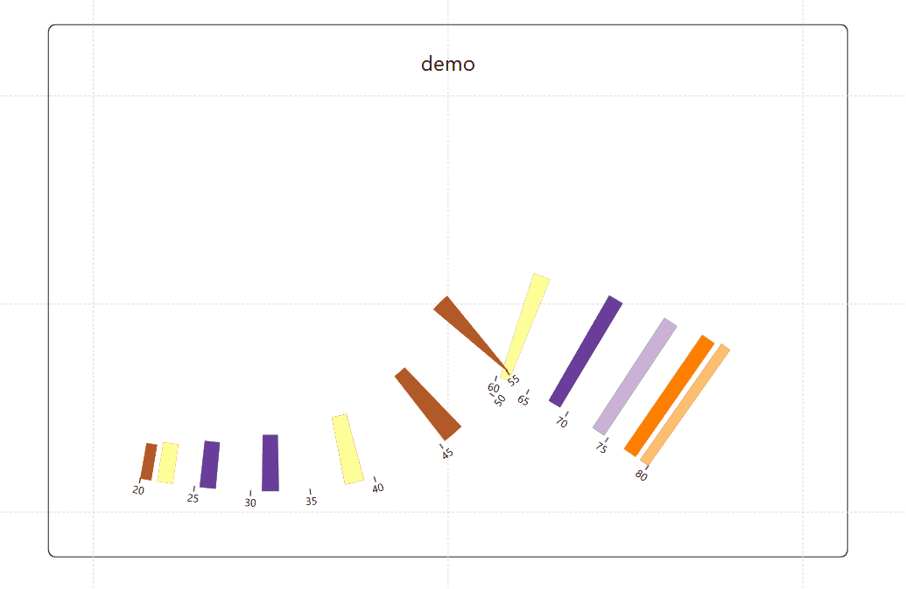

## Introducing the Cubic Bezier Axis Editor in Charticulator for line axis

Ever felt like your line charts with custom curve painted by mouse were a bit too... uneven? What if you could bend and shape your chart line axes to create truly unique and compelling visualizations?

I would like to announce new feature coming to Charticulator: the **Cubic Bezier Axis Editor**. This update gives you precise control to transform your standard line chart axes into beautifully curved paths.

### What is a Cubic Bezier Curve?

You might have encountered Bezier curves in graphic design software like Adobe Illustrator. In simple terms, a Bezier curve is a smooth, continuous line defined by a set of control points. Think of it like a flexible piece of wire. You have anchor points that define the start and end, and then "handles" that you can pull and push to bend the wire into the exact shape you want.

This update will be rolling out soon, so keep an eye out! I believe this feature will empower you to data visualization with Charticulator.
