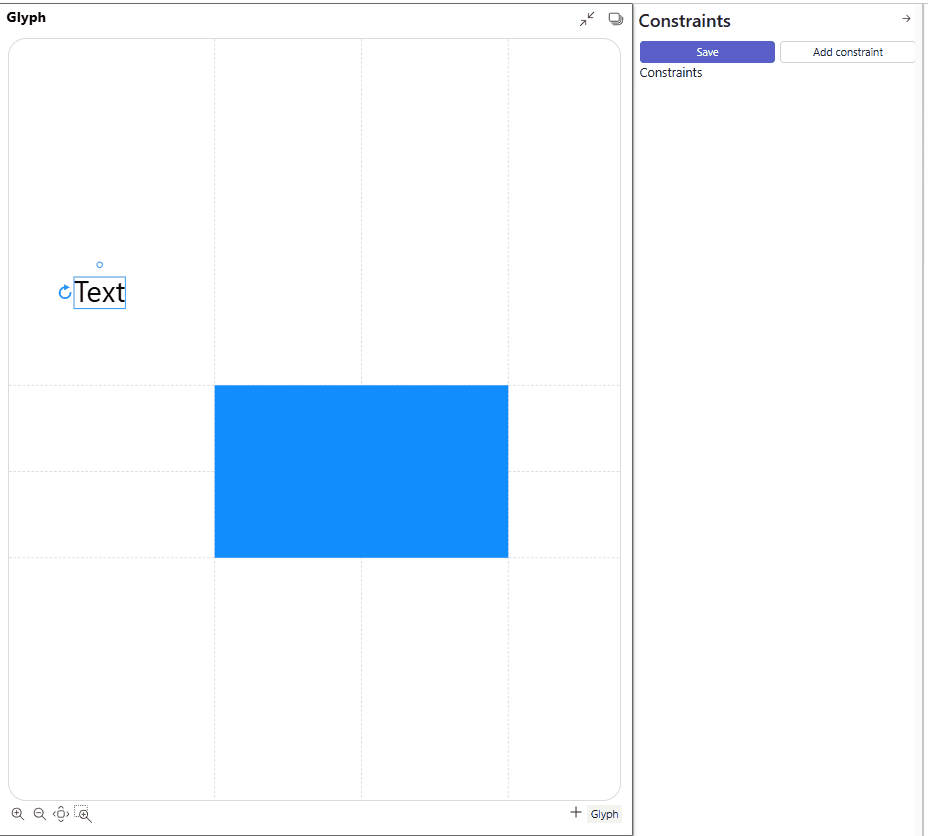

# Constraints editor

Constraint solver is core feature of the Charticulator that responsible for positioning of all objects on canvas.

Understanding this will help you understand why certain features work the way they do, how to use it to your advantage, and understand the limits of the editor's capabilities.

On snapping one mark anchor to another mark anchor Charticulator creates constraints that tells to constrains solver that anchor coordinates have to match, so it creates two constrains `Text1.x = Shape1.cx` and `Text1.y = Shape1.cy`.

Text has one anchor point with `x` and `y` attributes. Rectangle has 9 anchor points with attributes `x`, `x2`, `cx`, `y`, `y2`, `cy`. Combination of x and y attributes gives us points on 4 corners, in th middle of each edges and center of rectangle.

Snapping mark by mouse not always allows users to bind one mark to another properly. In the example above, snapping text to Rectangle mark impossible, because points are matches with anchors of Glyph borders. And text binds to Glyph instead Rectangle mark because glyph anchors has higher priority than Rectangle mark.

To bind the text mark to center of Rectangle mark need to use constraints editor.

