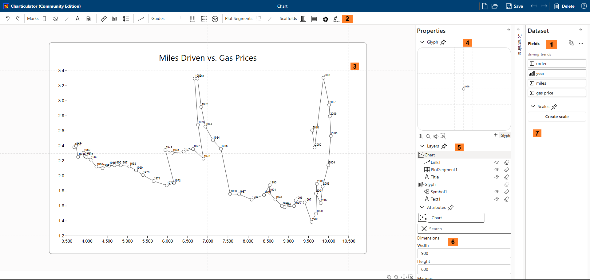
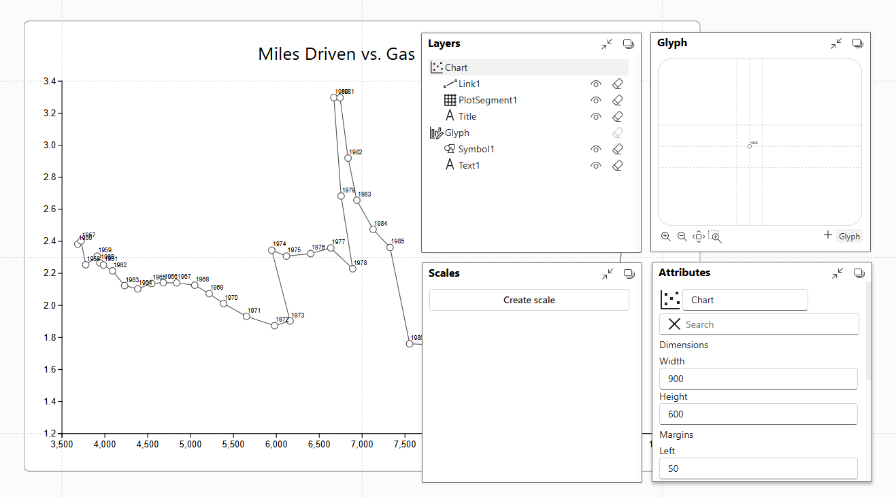
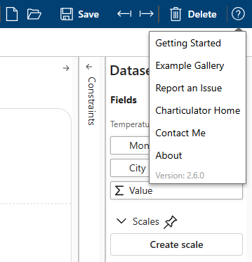
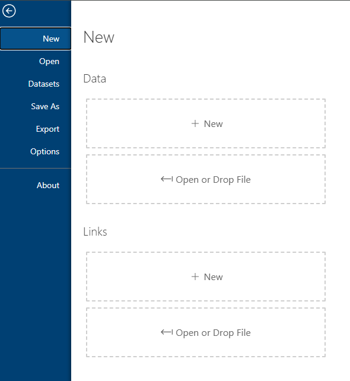
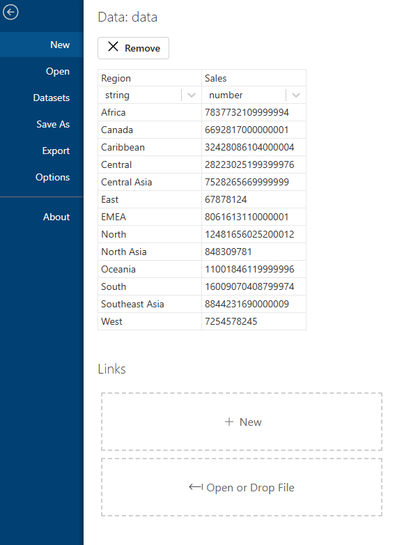
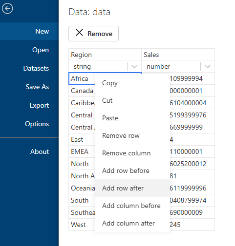

# Intro

This page describes four things that you need to learn in order to use Charticulator.
The documentation based on original source of [Charticulator documentation](https://charticulator.com/docs/getting-started.html) (copy is available on [Donghao Ren website](https://donghaoren.org/charticulator/index.html) the author of Charticulator).

This documentation is not complete, but will include new features and changes that aren't included original visual or Charticulator App.

## Terminology

- A **mark** is a primitive graphical element (e.g., rectangle, line, text).

- A **glyph** is a visual representation of a single data row. A glyph contains one or more **marks**.

- A **guide** is an auxiliary element for positioning marks or glyphs. Guides do not appear in exported charts.

- A **plot segment** lays out a set of glyphs.

- A **scaffold** or an **axis** specifies the layout property of one particular direction in a plot segment. A scaffold specifies a basic stacking layout without data binding and an axis specifies a layout that is bound to properties of the data. An axis can position glyphs according to a categorical data attribute or to a numerical data attribute.


## User Interface Components

Charticulator's user interface consists of the following components:

1. **Dataset Panel**: listing the columns in your dataset. Click the "..." button to view the actual data values.

2. **Toolbar**: widgets for specifying Marks, Links, Guides, Plot Segments, and Scaffolds.

3. **Chart Canvas**: a canvas for specifying the chart design.

4. **Glyph Editor**: a canvas for specifying the glyph design.

5. **Layers Panel**: listing the contents of the chart and glyph designs.

6. **Attributes Panel**: widgets for specifying the attributes and data bindings for each layer.

7. **Scales Panel**: listing the scales used in the chart.
   
<!--  -->


You can customize the position, size, and docking status of the *Glyph Editor*, *Layers Panel*, *Attributes Panel*, and *Scales Panel*. Click the dock status icon in the top right corner of each view to toggle its docking status. When the view is undocked, you can change its position and size.

<!--  -->


### Help Menu

Click the help icon in the top right corner to reveal links to several resources, including a link to this Getting Started page, the <a href="/gallery/index.html">Example Gallery</a>, a link to <a href="https://github.com/zbritva/charticulator/issues/new">create an issue</a> in Github repository.

<!--  -->



## Preparing Data

Charticulator supports datasets in [**CSV**](https://en.wikipedia.org/wiki/Comma-separated_values), [JSON](https://en.wikipedia.org/wiki/JSON) formats. For CSV Charticulator expects that **the first row contains the column names**. For JSON format it expects array of objects without nested objects.

Example of JSON array:

```json
[
   {
      "Name":"chevrolet chevelle malibu",
      "Miles_per_Gallon":18,
      "Cylinders":8,
      "Displacement":307,
      "Horsepower":130,
      "Weight_in_lbs":3504,
      "Acceleration":12,
      "Year":"1970-01-01",
      "Origin":"USA"
   },
   {
      "Name":"buick skylark 320",
      "Miles_per_Gallon":15,
      "Cylinders":8,
      "Displacement":350,
      "Horsepower":165,
      "Weight_in_lbs":3693,
      "Acceleration":11.5,
      "Year":"1970-01-01",
      "Origin":"USA"
   }
]
```

More examples can me found in [Vega repository](https://github.com/vega/vega/tree/main/docs/data)

For CSV format Charticulator is designed to support both the <a href="https://en.wikipedia.org/wiki/Wide_and_narrow_data">wide and narrow</a> format of a data table.

### Narrow

The table below shows (in narrow form) the market share of mobile operating systems from one year to the next.

|Year	|OperatingSystem	|MarketShare|
|-	|-	|-	|
|2009	|iOS	|59.35|
|2009	|Android	|5.58|
|2009	|Symbian	|2.5|
|2010	|iOS	|40.77|
|2010	|Android	|16.97|
|...	|...	|...|

### Wide
The table below shows (in wide form) the world population by gender and age. Because a glyph represents one data row, you need to use a <a href="/docs/user-interaction.html#data-driven-guides">data-driven guide</a> to position multiple marks based on numerical data values in a glyph.

|Age|Female|Male|
|-|-|-|
|0-4|327.601|350.321|
|5-9|316.714|338.892|
|10-14|301.011|322.363|
|15-19|288.482|308.333|
|20-24|287.820|306.100|
|...|...|...|

### Data for Links
To draw charts with the links between glyphs, you will need two data tables: one for nodes/entities and another for links/relationships between nodes. For example, to draw the arc chart below (character co-ocurrence in Les Miserables), you will need one table for the characters and another for their co-occurrences.


Charticulator expects the nodes table to contain an `id` column and the links table to contain `source_id` and `target_id` columns, which refer to the `id`s in the nodes table, as illustrated below. Note that these column names are **case sensitive**.

<table>
<thead>
<tr><th>id</th><th>Name</th><th>Group</th></tr>
</thead>
<tbody>
<tr><td>Myriel</td><td>Myriel</td><td>G01</td></tr>
<tr><td>Napoleon</td><td>Napoleon</td><td>G01</td></tr>
<tr><td>Valjean</td><td>Valjean</td><td>G02</td></tr>
<tr><td>Marguerite</td><td>Marguerite</td><td>G03</td></tr>
<tr><td>...</td><td>...</td><td>...</td></tr>
</tbody>
</table>

<table>
<thead>
<tr><th>source_id</th><th>target_id</th><th>Strength</th></tr>
</thead>
<tbody>
<tr><td>Napoleon</td><td>Myriel</td><td>1</td></tr>
<tr><td>Valjean</td><td>Myriel</td><td>5</td></tr>
<tr><td>Marguerite</td><td>Valjean</td><td>1</td></tr>
<tr><td>...</td><td>...</td><td>...</td></tr>
</tbody>
</table>


## Loading Data

When you launch Charticulator, it automatically invokes the "New" chart command. Because you need to load data in order to create a chart, the New chart panel lets you select data files. You can click the button or drag a CSV file into the button area to open the data file. 



Once you choose the data file, Charticulator previews the data and allow editing data.

<!--  -->


Context menu allow to add/remove columns and rows.



Now you are ready to [create a chart with Charticulator](./user_interaction.mdx) and follow along with [community created video tutorials](../category/community-content).

Also note that many of the charts in our [gallery](./gallery/index.mdx) have an associated video of their creation process.
