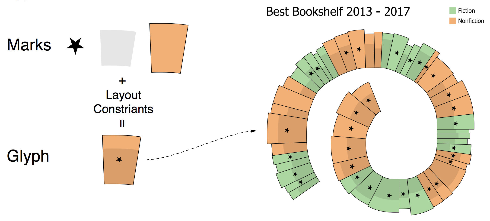
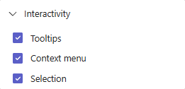
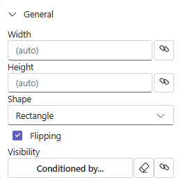
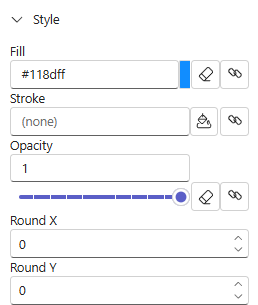
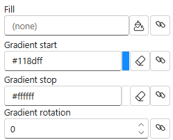
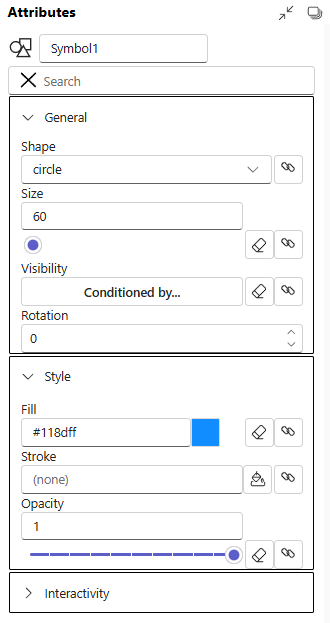

# Marks, Glyphs and Plot Segments

Each mark and glyph can have 2 type of settings in attribute panel.

Properties - settings with values are the same for all instance of marks in all glyphs. Examples are shape of Shape mark, interactivity properties, Round X, Round Y values. Properties doesn't supports binding data.

Attributes - settings with values are can be different in different glyphs. Examples are height, width of shape, size of symbol e.t.c. Attributes supports data binding. When column binds to attribute, Charticulator creates correspond scale to map values of column to attributes values. Example is binding numerical column to height of Shape.

## Glyph

A glyph is a visual representation of a single data row. A glyph contains one or more [marks](#marks).

Glyphs are contained in [Plot Segments](#plot-segments).

## Marks

Interactivity properties controls user interactions with mark.

By default all properties is on. Mark handles mouse over, click and context menu calls.

### Rectangle, Triangle, Oval

Shape is basic mark of Charticulator that represents rectangle, oval, and triangle with height and width attributes.

In general section shape has Height, Width attributes and Shape, Flipping properties.

Shape property sets visual representation of shape and has values Rectangle, Triangle, Oval. The Shape property doesn't change internal representation of geometry, the Shape still has Height and Width attributes. There is no radiuses for Oval.

Style section has Fill, Gradient start, Gradient end, Gradient rotation, Stroke, Opacity  attributes and `Round X`, `Round Y`, `Flipping` properties.

*`Round X` and `Round Y` properties applicable for Rectangle shape only.*

`Round X` - the horizontal corner radius of the rectangle.

`Round Y` - the vertical corner radius of the rect rectangle.

`Flipping` - allow to rectangle flip horizontally or vertically. For example, if left side (`x1` attribute) of rectangle has bigger value that right side (`x2` attribute) rectangle is flipped or width attribute has negative value. Unchecking property adds constraint that `width` >= `0` that prevents flipping the rectangle.

#### Shape gradient

To set gradient attributes, need to remove Fill attribute data binding or value.2

### Symbol

Symbol is a graphical object that have list of predefined shapes. Shape has only position and size attributes, there are no width or height.

### Line

TBD

### Text

TBD

### Text Box

TBD

### Polygon

TBD

### Icon

TBD

### Image

TBD

### Data Axis

TBD

### Nested Chart

TBD

## Plot Segments

TBD

### Polar Plot Segment

TBD

### Custom Curve Plot Segment

TBD

### Line Plot Segment

TBD

## Guides

TBD

### Single guide

TBD

### Multiple Guides

TBD

## Legends

TBD

## Links

TBD

### Line link

TBD

### Band link

TBD