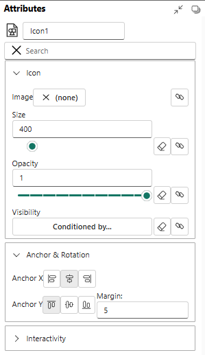

# Marks, Glyphs and Plot Segments

Each mark and glyph can have 2 type of settings in attribute panel.

Properties - settings with values are the same for all instance of marks in all glyphs. Examples are shape of Shape mark, interactivity properties, Round X, Round Y values. Properties doesn't supports binding data.

Attributes - settings with values are can be different in different glyphs. Examples are height, width of shape, size of symbol e.t.c. Attributes supports data binding. When column binds to attribute, Charticulator creates correspond scale to map values of column to attributes values. Example is binding numerical column to height of Shape.

---

## Glyph

A glyph is a visual representation of a single data row. A glyph contains one or more [marks](#marks).

Glyphs are contained in [Plot Segments](#plot-segments).

---

## Marks

Interactivity properties controls user interactions with mark.

By default all properties is on. Mark handles mouse over, click and context menu calls.

### Rectangle, Triangle, Oval

Shape is basic mark of Charticulator that represents rectangle, oval, and triangle with height and width attributes.

In general section shape has Height, Width attributes and Shape, Flipping properties.

Shape property sets visual representation of shape and has values Rectangle, Triangle, Oval. The Shape property doesn't change internal representation of geometry, the Shape still has Height and Width attributes. There is no radiuses for Oval.

Style section has Fill, Gradient start, Gradient end, Gradient rotation, Stroke, Opacity  attributes and `Round X`, `Round Y`, `Flipping` properties.

*`Round X` and `Round Y` properties applicable for Rectangle shape only.*

`Round X` - the horizontal corner radius of the rectangle.

`Round Y` - the vertical corner radius of the rect rectangle.

`Flipping` - allow to rectangle flip horizontally or vertically. For example, if left side (`x1` attribute) of rectangle has bigger value that right side (`x2` attribute) rectangle is flipped or width attribute has negative value. Unchecking property adds constraint that `width` >= `0` that prevents flipping the rectangle.

#### Shape gradient

To set gradient attributes, need to remove Fill attribute data binding or value

---

### Symbol

Symbol is a graphical object that have list of predefined shapes. Shape has only position and size attributes, there are no width or height.

---

### Line

Line mark 

---

### Text

Text mark for rendering text values.

---

### Text Box

Text mark for rendering text values. But has with, height, background attributes.

---

### Polygon

Polygon is a plane figure made up of line segments connected to form a closed polygonal chain.

---

### Icon

---

### Image

---

### Data Axis

A **Data Axis** is a fundamental component used to map a data column to a visual axis, such as an X or Y axis in a Cartesian coordinate system or an angular axis in a polar system. It controls the scale, range, and appearance of ticks and labels.

---

#### Key Properties
- **Data Columns**: The numerical or categorical data field that the axis represents.
- **Range**: The minimum and maximum values to display on the axis. Can be automatically determined from the data or set manually.
- **Tick Format**: Specifies how the axis labels should be formatted (e.g., as percentages, currency, or with a specific number of decimal places).

#### Usage Example
To create a simple bar chart, you would drag a categorical data column to the Y-axis and a numerical data column to the X-axis of a plot segment. The Data Axis object allows you to then customize the appearance and scale of both axes.

---

### Nested Chart
A **Nested Chart** is a powerful feature that allows you to embed a complete chart specification within the glyph of another chart. It's primarily used to create "small multiples" or trellis plots, where each data point in the main chart is represented by a smaller, detailed chart.

#### Key Properties
- **Glyph Anchor**: The point within the parent chart's glyph where the nested chart is placed.
- **Data Mapping**: Defines how data is filtered and passed from the parent chart to the nested chart.
- **Sizing**: Controls the width and height of the nested chart area.

#### Usage Example
Imagine a scatter plot showing average sales per country. With a Nested Chart, each point (representing a country) could be replaced by a small line chart showing the sales trend over time for that specific country.

---

### Plot Segments
**Plot Segments** are the canvases or coordinate systems where marks (like symbols, lines, and text) are drawn. They define the structure of your chart, such as whether it uses a Cartesian (X, Y), polar, or custom coordinate system.

#### Common Types
- **Line Plot Segment**: For standard Cartesian charts.
- **Polar Plot Segment**: For radial charts like pie or donut charts.
- **Custom Curve Plot Segment**: For charts laid out along a custom path.

---

### Polar Plot Segment
A **Polar Plot Segment** defines a radial coordinate system. Instead of X and Y axes, it uses an **angular** axis (for the angle) and a **radial** axis (for the distance from the center). It is the foundation for creating charts like pie charts, donut charts, radial bar charts, and star plots.

#### Key Properties
- **Angular Axis**: Binds data to the angle (0 to 360 degrees).
- **Radial Axis**: Binds data to the distance from the center point.
- **Inner/Outer Radius**: Defines the size of the plot area, allowing for the creation of donut charts by setting an inner radius greater than zero.

#### Usage Example
To create a donut chart, you would use a Polar Plot Segment, map a categorical data field to the angular axis (to create the slices), and set a fixed inner and outer radius.

---

### Custom Curve Plot Segment
The **Custom Curve Plot Segment** is an advanced feature that allows you to lay out data along an arbitrary, user-defined curve. This enables highly customized and unique visualizations that don't fit into standard Cartesian or polar coordinate systems. You can draw a curve, and Charticulator will use it as the primary axis for arranging glyphs.

#### Key Properties
- **Curve Editor**: An interface to draw and edit the custom path.
- **Axis Binding**: Data is mapped along the length of the curve.
- **Normal/Tangent**: Glyphs can be oriented relative to the curve's direction at any given point.

#### Usage Example
Creating a visualization that follows the path of a river on a map, where data points are positioned along the river's drawn curve.

---

### Line Plot Segment
This is the most common type of plot segment. A **Line Plot Segment** defines a standard 2D Cartesian coordinate system with **X** and **Y** axes. It is the container used for creating bar charts, line charts, scatter plots, area charts, and many other conventional chart types.

#### Key Properties
- **X Axis / Y Axis**: Drop zones for binding data to the horizontal and vertical dimensions.
- **Margins**: Padding between the data-bound area and the edge of the segment.
- **Glyph Layout**: Can be configured to stack or pack glyphs within the plot area.

#### Usage Example
Any standard scatter plot is built using a Line Plot Segment where two numerical data columns are mapped to the X and Y axes, and a symbol mark is added to the glyph.

---

### Guides
**Guides** are visual aids used to positioning marks in a chart.

#### Single guide
A **Single Guide** is a straight line drawn at a specific value on an chart canvas. It is static and manually positioned.

### Multiple Guides
**Multiple Guides** (or data-driven guides) create a set of lines based on count in a property. This is useful for creating grid-like patterns.

---

### Legends
A **Legend** is a component that explains the visual encoding of data in a chart. It deciphers how data values are mapped to visual properties like color, size, or shape, making the chart readable. Charticulator can automatically generate legends for scales you create.

#### Common Legend Types
- **Categorical Legend**: Shows the mapping between discrete categories and their assigned colors or shapes.
- **Gradient Legend**: Shows the color scale used for a continuous numerical data range.
- **Size Legend**: Shows how symbol size corresponds to numerical values.

#### Usage Example
If you create a scatter plot where the color of each point represents a product category, a legend will automatically appear showing which color corresponds to which category.

---

### Links
**Links** are marks used to connect multiple data points (glyphs). They are essential for creating visualizations like line charts, network diagrams, and Sankey diagrams. Links are drawn based on a specified ordering or relationship between data points.

---

### Line Link
A **Line Link** connects a sequence of data points with a line. The line can be straight, curved, or stepped. This is the primary component used for creating line charts and path-based visualizations.

#### Key Properties
- **Order By**: A data column used to determine the connection sequence (e.g., a date/time field for a time-series chart).
- **Interpolation**: The type of line to draw between points (e.g., `Linear`, `Curve`, `Step`).
- **Stroke**: The color, width, and style (e.g., dashed, solid) of the line.

#### Usage Example
To create a time-series line chart, you would create a glyph with a symbol, order the data by a date attribute, and then add a Line Link to connect the glyphs in chronological order.

---

### Band Link
A **Band Link** is a more complex link that connects two sets of points to create a filled polygonal area. It is most commonly used for creating Sankey diagrams (to show flow), bump charts, or stacked area charts where the thickness of the band represents a quantity.

#### Key Properties
- **Link By**: Defines the common data field(s) used to group the start and end points of the band.
- **Path Definition**: Specifies the anchor points on the start and end glyphs from which the band is drawn.
- **Fill**: The color of the filled area.
