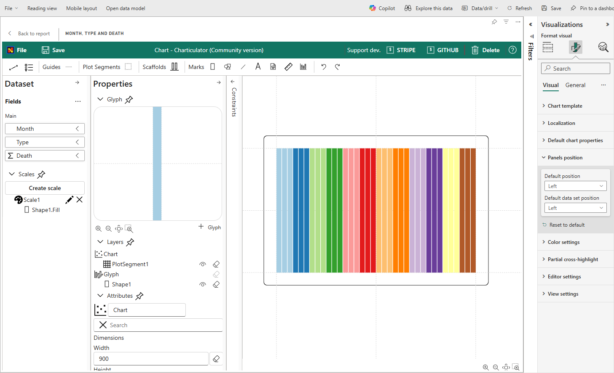
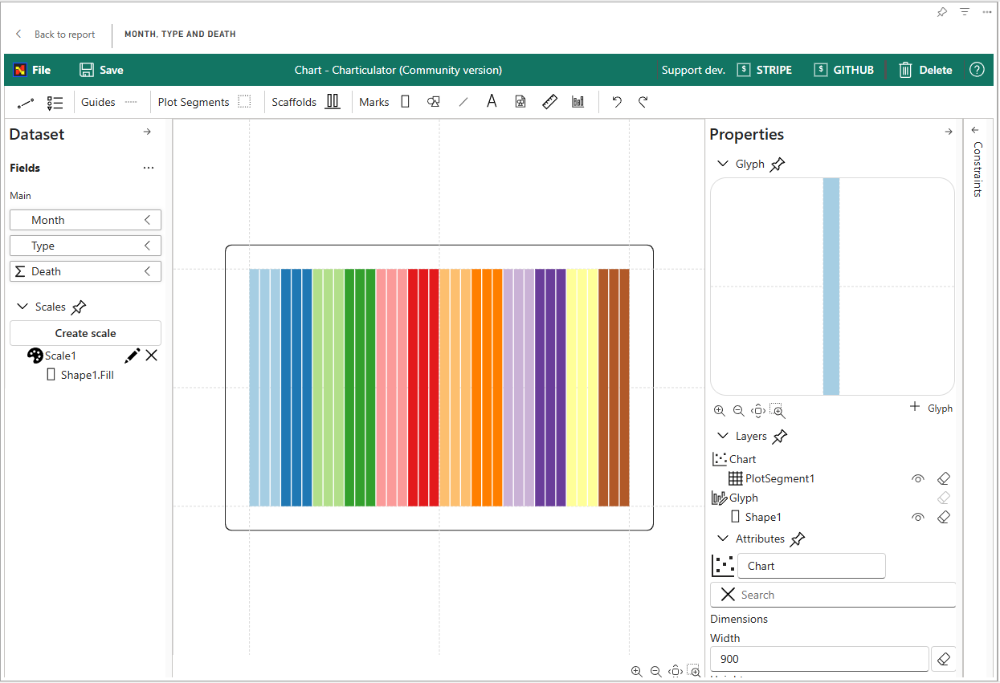

import { Player } from '@site/src/components/Player';
import { Icon } from '@site/src/components/Icon';

# Using in Power BI

## Difference from Original version of the visual

The visual was split into two different visual (VIEW and EDITOR). The Editor has built in editor that allows to create charts from scratch. The View doesn't have built in editor and support only importing templates and mapping data.

Reasons for that:

* The View is Power BI certified. And cannot access external resources.
* The View contains less code than the Editor version and size of package is significantly smaller. It speeds up loading reports.
* The Editor is not certified and there is no plans for certification.
* The Editor is going to have public gallery of charts that will allow easily import charts made by community.

**Don't use Editor version of the visual on the final reports for consumers**.

## Getting started

You can import the chart design, exported as template, into Power BI. Once its required data fields are filled and mapped, you can see the chart within Power BI.
<!-- () -->
In addition, the chart reacts to the event from other charts or slicers. For example, you can create a slicer using the Month value of the `DATE` value so that you can interactively choose the desired month to be shown.

<!-- () -->
<Player url="/videos/tutorials/tutorial8.mp4" timeToStart={52.70} timeToStop={61.00} />

On Power BI report:
<!--  -->

Charticulator’s underlying framework handles data tables in a certain way, expecting data tables are formatted in a specific way. Some of the Power BI’s default behaviors do not satisfy the expectations and cause unwanted results. Here, we explain how to configure the settings in Power BI to meet Charticulator’s expectations.

## Don't Summarize

In Charticulator, a glyph represents one data row. For example, to create a bar chart, each row in the data table must correspond to one bar. On the other hand, Power BI “summarizes” data by default. For example, with the 200 mushrooms dataset, for a numerical data field (ID), Power BI automatically computes the Count, the number of rows with the same set of data values (see the left figure below). To ensure that each data row is drawn as a glyph in Charticulator, you need to tell Power BI not to summarize, by selecting the **Don’t summarize** menu item.

<!--  -->

## Data Order

By default, Charticulator does **not** sort data and handles the data in the order they appear in the table. On the other hand, Power BI usually tries to order data in a predefined way (based on data values). Therefore, if you want to enforce an order that is not based on existing data values, you need to add a data field to specify order and then order the table based on that field.

<!--  -->

## Date vs. Date Hierarchy

For the date type data value (e.g., "02/24/2021"), Charticulator automatically extracts its subcomponents (e.g., day, dayOfYear, weekday). On the other hand, Power BI creates a date hierarchy, consisting of Year, Quarter, Month, and Day, and uses the date hierarchy by default. Therefore, to reuse a chart design created with Charticulator in Power BI, you need to select the **Date** menu item.

<!--  -->

## Creating a Chart with Links

To draw a chart with the links between glyphs in Charticulator, you need two data tables: one for nodes (or entities) and another for links (or relationships) between nodes. Because Power BI visuals expects a single table, you need to create a relationship between these two tables, by following these steps:
1. Select **Modeling** from the main menu.
2. Select **Manage relationships** from the ribbon.
3. In the Manage relationships window, select **New…**.
4. In the Create relationship window, follow these steps:
    1. Select the table for nodes from the first dropdown menu.
    2. Select the table for links from the second dropdown menu.
    3. Select the id column from the table for nodes.
    4. Select the source_id column from the table for links.
    5. Select Many to many (*.*) from the Cardinality dropdown.
    6. Select OK to compete the relationship creation process.
   

After creating the relationship, do not forget to select both **Don’t summarize** and **Show items with no data** for all columns in the Data and Links sections.

## Visual Settings

These properties control the behavior, appearance, and localization of the Charticulator visual and its editor.

***

### Chart Template
Controls the core chart design and data mapping.

* **Template:** Stores the `.chart` template file that defines the visual's structure and design.
* **Column Mapping:** Defines how data columns from your Power BI dataset are mapped to the fields required by the template. This is primarily used for backward compatibility with older templates.

***

### Localization 🌍
Configure number and currency formatting to match regional standards.

* **Decimal Delimiter:** Sets the character used for the decimal point (e.g., `.` or `,`).
* **Thousands Delimiter:** Sets the character used for the thousands separator (e.g., `,` or `.`).
* **Currency:** Defines the currency symbol (e.g., `$`, `€`, `£`) for monetary formats.
* **Billions Format:** Specifies the suffix for large numbers, allowing a choice between **G** (for giga) or **B** (for billions).

***

### Default Chart Properties
Sets the default visual properties (such as colors, fonts, and styles) that are applied to any new charts you create from scratch.

***

### Panel Positions
Customizes the layout of the Glyphs, Layers, and Attributes panels within the Charticulator editor to suit your workflow.

* **Panels on Left:** Places all editing panels on the left side of the canvas.

    
* **Panels on Right:** Places all editing panels on the right side of the canvas.
    

* **Split Panels:** Places the Dataset panel on the left and the Attributes/Layers panels on the right.

    

***

### Color Settings 🎨
Integrate your chart's appearance with the Power BI report theme.

* **Update Colors:** Applies the current Power BI report theme's color palette to the chart, overriding any existing colors defined in the template.
* **Power BI Theme:** Applies the Power BI report theme (including background and text colors) to the Charticulator editor interface itself.
* **Invert Text Colors:** When using a dark Power BI theme, this option automatically inverts text colors within the editor for better readability.

***

### Partial Cross-Highlight
This setting enhances how the visual interacts with other visuals in your report.

* **Add Highlight Columns:** Adds supplementary columns to your dataset that contain highlight values for each measure. This enables **partial cross-highlighting**, where only a segment of a mark (like a portion of a bar) is highlighted instead of the entire object.

***

### Editor & View Settings
Configure the behavior of the editor interface and the visual canvas.

* **Update Table:** Automatically refreshes the data tables within the Charticulator editor whenever the data is filtered in Power BI or when data columns are assigned or removed.
* **Hide Editor Preview:** Hides the initial preview image that appears in the editor window before a template is loaded.
* **Hide Default Template Message:** Hides the message displayed on the Power BI visual canvas when