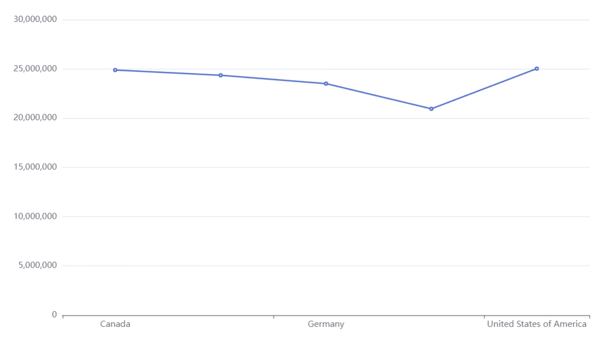

# Apache ECharts visual

## Description

[Apache ECharts](https://echarts.apache.org/en/index.html) is an Open Source JavaScript Visualization Library with Declarative Framework for a for Rapid Construction of Web-based Visualization.

The EChart Visual combines power of ECharts and Handlebars.js with Power BI data to build [about 20 chart types](https://echarts.apache.org/examples/en/index.html) within Power BI like [Deneb](https://deneb-viz.github.io/) or [Plotly.js](https://akvelon.github.io/plotlyjsvisual/) visuals.

## Overview

The visual initializes container and prepares data for the visual. Authors have to specify [options for the chart](https://echarts.apache.org/en/option.html#title).

The visual creates [ECharts dataset](https://echarts.apache.org/handbook/en/concepts/dataset) from data provided for the visual by Power BI. Or user can use Power of [Handlebars.js expressions](https://handlebarsjs.com/guide/expressions.html) to bind data directly data properties of ECharts option.


### Power BI Visuals Editor

[Power BI Visuals Editor](https://appsource.microsoft.com/en-us/product/power-bi-visuals/ilfatgaliev1696579877540.editorvisual?tab=Overview) supports EChart options schema to provide autocomplete.

<iframe width="560" height="315" src="https://www.youtube.com/embed/R7GUcmipPvY?si=YCNJ4-YYldJl1FEr" title="YouTube video player" frameborder="0" allow="accelerometer; autoplay; clipboard-write; encrypted-media; gyroscope; picture-in-picture; web-share" referrerpolicy="strict-origin-when-cross-origin" allowfullscreen></iframe>

### Built in editor

When the visual has not options configuration or in Edit mode the visual displays built in editor:


The editor based on [React Ace Editor](https://github.com/securingsincity/react-ace) and has lack features than [Power BI Visual Editor](https://appsource.microsoft.com/en-us/product/power-bi-visuals/ilfatgaliev1696579877540.editorvisual?tab=Overview).

### Handlebars.js templates

The visual supports [Handlebars.js expressions](https://handlebarsjs.com/guide/expressions.html) for configure the visual options and binding data. And provides [additional helpers](./../handelbars-visual/helpers.md) to manipulate with data and use [D3.js capabilities (axes, scales, formatting e.t.c.)](https://d3js.org/getting-started).

Handlebars.js example of using 'column' helper to get column values:

```json5
{
 "dataset": {
  "dimensions": [
   "Country",
   " Sales",
  ],
 },
 "xAxis": {
  "type": "category",
  // HBT data: {{{ column 'Country' }}},
 },
 "yAxis": {
  "type": "value",
 },
 "series": [
  {
   // HBT data: {{{ column ' Sales' }}},
   "type": "line",
  },
 ],
}
```

'column' helper returns array of all values for given colum name.

### Examples

The visual provides simple examples of EChart configuration for various chart types:


## Creating chart from scratch

The flow of processing data and user defined chart schema:

//TODO add chart

import { EChartVisualDiagram } from '@site/src/components/EChartVisualDiagram';


1. [Download](https://ilfat-galiev.im/visuals/echartsVisual.1.0.0.0.pbiviz) and import *.pbiviz file

    

2. Create instance of the visual by clicking on the visual icon

    

3. Assign data to the visual instance

    

4. Resize visual to give more space to visual content and switch to edit mode.

    

5. Select the predefined charts from the tree. There are several basic chart examples. The list will be update to add new charts late. [To see all chart types navigate to Examples section of ECharts Documentation](https://echarts.apache.org/examples/en/index.html)

6. The visual in edit mode has tree of charts, preview area and JSON editor

    Preview are shows current chart configuration after pressing "Apply" button
    

    Editor provides basic editing capabilities to edit JSON5 schema with Handlebar templates
    

7. If the visual configuration has error, the visual shows error output instead chart preview.

    

8. Data binding and handlebars template.

    EChart has [options object](https://echarts.apache.org/en/option.html#title) that contains chart configuration and settings

    Options is JavaScript object, but the visual allows use JSON only ([JSON5 format](https://json5.org/)).

    To provide dynamic binding, the visual support Handlebar templates in comment section.

    All comments beginning with ` HBT ` (whitespace are required) parses by [Handlebars.js](https://handlebarsjs.com/).

    There you can use [power of Handlebars language](https://handlebarsjs.com/guide/#what-is-handlebars) to generate JSON configuration for the EChart.

    Handlebars provides [builtin expressions](https://handlebarsjs.com/guide/expressions.html#basic-usage) and [helpers](https://handlebarsjs.com/guide/builtin-helpers.html).

    But the visual defines the set of own helpers like [HTML/SVG/Handlebars Visual](../handelbars-visual/helpers.md) that makes easy to bind data to the JSON file.

    But EChart visual has additional helpers like `column`, `select`, `jsonArray`

    `column` - returns array of column values for given column name. Example: `{{{ column 'Country' }}}` returns `["Canada","France","Germany","Mexico","United States of America"]`

    `select` - returns arrays of columns values for given column names.

    `jsonArray` - wraps input to `[`,`]` brackets.

    Data Mapping example:

    ```json5
    {
        "xAxis": {
          "type": "category",
          // HBT "data": {{{ column 'Country' }}},
        },
        "yAxis": {
          "type": "value"
        },
        "series": [
          {
            // HBT "data": {{{ column ' Sales' }}},
            "type": "line"
          }
        ]
      }
    ```

    This JSON5 configuration has two templates:

    `// HBT "data": {{{ column 'Country' }}},`

    and

    `// HBT "data": {{{ column ' Sales' }}},`

    Handlebars uses the each template to generate part of content for JSON5. `column` helper returns array of column values. Then the visual removes the comments to leave only part of json. The JSON5 content transforms to

    ```json5
    {
        "xAxis": {
          "type": "category",
          "data": ["Canada","France","Germany","Mexico","United States of America"],
        },
        "yAxis": {
          "type": "value"
        },
        "series": [
          {
            "data": ["24887654.88499999","24354172.28000001","23505340.820000004","20949352.109999992","25029830.165000007"],
            "type": "line"
          }
        ]
      }
    ```

    The result config is input object for [options](https://echarts.apache.org/en/option.html#title) parameter of EChart instance.

9. The result

    

## Plotly.js style data binding

The visual supports data binding by `<another property name>src` property:

    ```json5
  {
      "xAxis": {
        "type": "category",
        "data": [],
        // Binds "Country" column values to data property
        "datasrc": "Country",
      },
      "yAxis": {
        "type": "value"
      },
      "series": [
        {
          "data": [],
        // Binds " Sales" column values to data property
          "datasrc": " Sales",
          "type": "line"
        }
      ]
    }
  ```