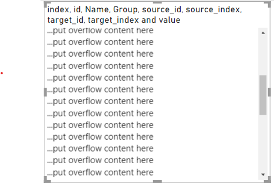

# Page for answers

## How to add scrolling

Wrap content with `div` tag:

```html
<div style="overflow-y:scroll;height:100%;width:100%">
    <p>...put overflow content here</p>
    ...
</div>
```

With `height:100%;width:100%` the `div` tag will have the same size as visual container.



Content will be added...
