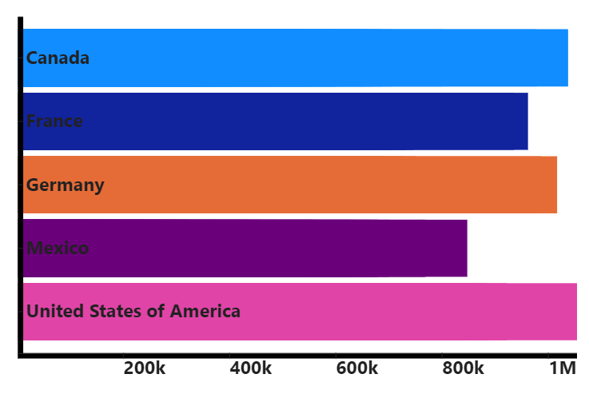

# Getting Started

The visual uses Handlebars.js to render template and bind data from Power BI. Read mode about [Handlebars.js](https://handlebarsjs.com/guide/) before start.

[Download the visual or sample report file on Appsource page](https://appsource.microsoft.com/en-us/product/power-bi-visuals/ilfatgaliev1696579877540.handlebars_visual?tab=Overview)

[Power BI Visual Editor](https://appsource.microsoft.com/en-US/product/PowerBIVisuals/ilfatgaliev1696579877540.editorvisual) can be used for editing HTML/SVG content with autocomplete and syntax highlight

Or prepare your own dataset.

Follow the [Step by step guide](./step-by-step.md) to create simple bar chart example:



Full template:

```html
{{ var 'margin' 30}}
{{ var 'svgHeight' (sub viewport.height (val 'margin'))}}
{{ var 'chartHeight' (sub viewport.height 90)}}
{{ var 'svgWidth' (sub viewport.width 30)}}
{{ var 'rectHeight' (divide (val 'chartHeight') table.rows.length)}}
{{ var 'sales' (map ' Sales' table.rows) }}
{{ var 'countries' (map 'Country' table.rows) }}
{{ scaleLinear 'Scale X' (array ( min (val 'sales')) ( max (val 'sales'))) (array 0 (val 'svgWidth'))}}
{{ scaleBand 'Scale Y' (val 'countries') (array 0 (val 'chartHeight'))}}
{{ axisBottom 'axisMeasure' 'Scale X' }}
{{ axisRight 'axisCategory' 'Scale Y' }}
{{ setupScale 'Scale Y' 'paddingOuter' 0.2 }}
{{ setupScale 'Scale Y' 'paddingInner' 0.1 }}
{{ setupAxis 'axisMeasure' 'tickFormat' '~s' }}
{{ setupAxis 'axisMeasure' 'ticks' 5 }}
<svg width="{{val 'svgWidth'}}" height="{{ val 'svgHeight' }}">
    <g transform="translate({{val 'margin'}}, {{val 'margin'}})">
        <g>
            {{#each table.rows}}
            <rect
                x="0"
                y="{{{ useScale 'Scale Y' this.Country }}}"
                width="{{{ useScale 'Scale X' this.[ Sales] }}}"
                height="{{{ getScale 'Scale Y' 'bandwidth' }}}"
                fill="{{{ useColor this.Country }}}">    
            </rect>
            {{/each}}
        </g>
        <g transform="translate(0, {{val 'chartHeight'}})">
            {{{ useAxis 'axisMeasure' 'Scale X' }}}
        </g>
        <g transform="translate(0, 0)">
            {{{ useAxis 'axisCategory' 'Scale Y' }}}
        </g>
    </g>
</svg>
<style>
    .tick text {
        font-size: 20px;
        font-weight: 700;
    }
</style>
```

## Handlebarsjs defined context

`table` - contains data from Power BI in table structure.

`table.rows` - contains rows content from Power BI as JS objects.

Usage:

```svg
{{#each table.rows}}
    <text>
        {{ this.Country }}   
        ...
    </text>
{{/each}}
```

Prints the list of country names in `Country` column.

Where `Country` is column name assigned to the visual.

`table.columns` - contains list of columns from Power BI.

Usage:

```svg
{{#each table.columns}}
    {{this.displayName}}
{{/each}}
```

`viewport` - contains visual viewport size

`viewport.height` - height of viewport

Usage:

`{{ viewport.height }}`

`viewport.width` - width of viewport

usage:

`{{ viewport.width }}`

