# Step by step guide

## Import visuals

Import Power BI Visual Editor and HTML/SVG/Handlebars Visual files into Power BI.

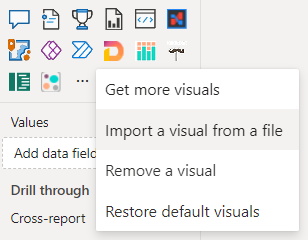

[Read more about importing visuals in official documentation](https://learn.microsoft.com/en-us/power-bi/developer/visuals/import-visual#import-a-visual-file-from-your-local-computer-into-power-bi). 

To use visual, click the visual icon in the visualization panel, or open the report context menu if you are using the [object interaction preview feature](https://learn.microsoft.com/en-us/power-bi/create-reports/power-bi-on-object-interaction#build-a-visual-with-on-object-interaction), and select "Add Visual".

Switch the Editor Visual settings to customize the HTML/SVG/Handlebars Visual settings:

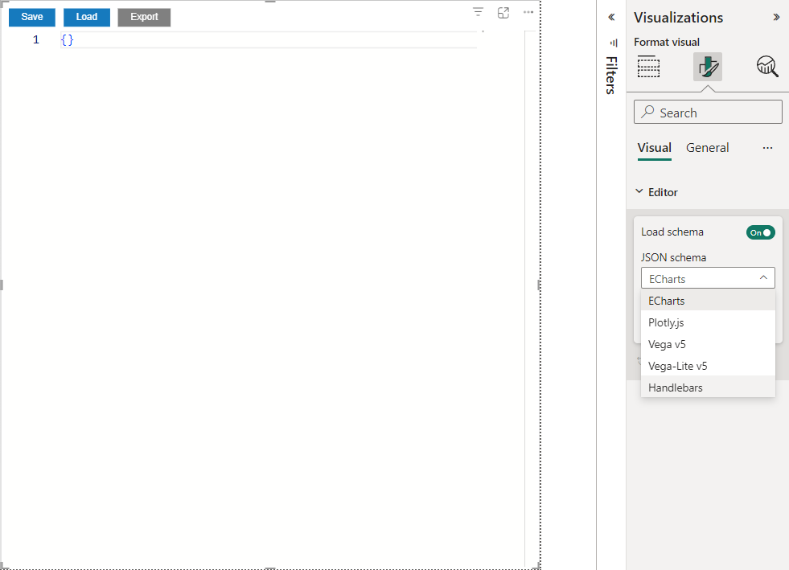

Select "Handlebars" for "JSON Schema" and "HTML/SVG/Handlebars" for "Target visual for editing".

Assign data to the visual. You need one categorical column and one measure.

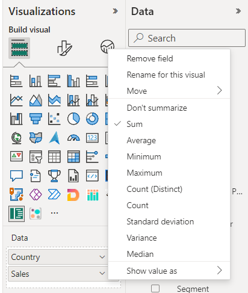

The editor is ready to use.

## Creating variables and using context

The visual defines table and viewport objects in the context of Handlebars.

To output the values of a context object, use an expression with HTML:

```html
<p>height: {{ viewport.height }}</p>
<p>width: {{ viewport.width }}</p>
```

Then click save button:

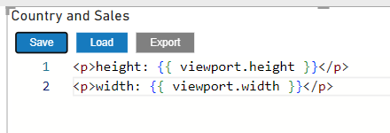

Ensure "Visual Editor" is selected and click on HTML/SVG/Handlebars visual icon to switch visual:

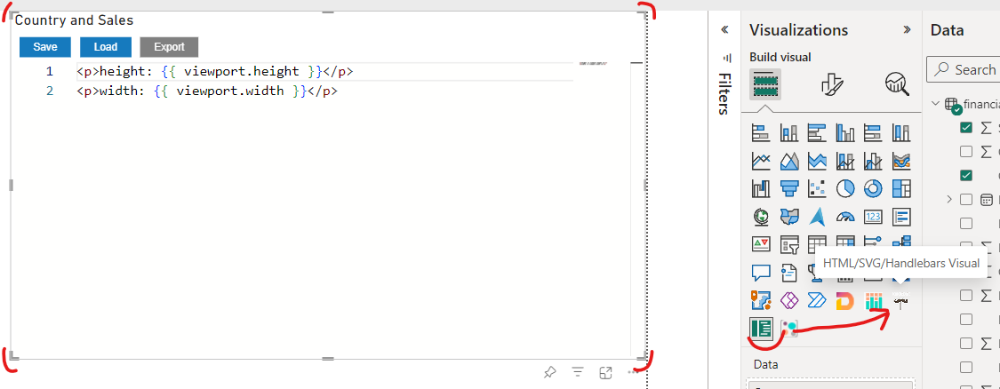

The HTML/SVG/Handlebars should render height and width values:

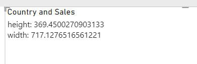

The template rendering responses to visual resizing:

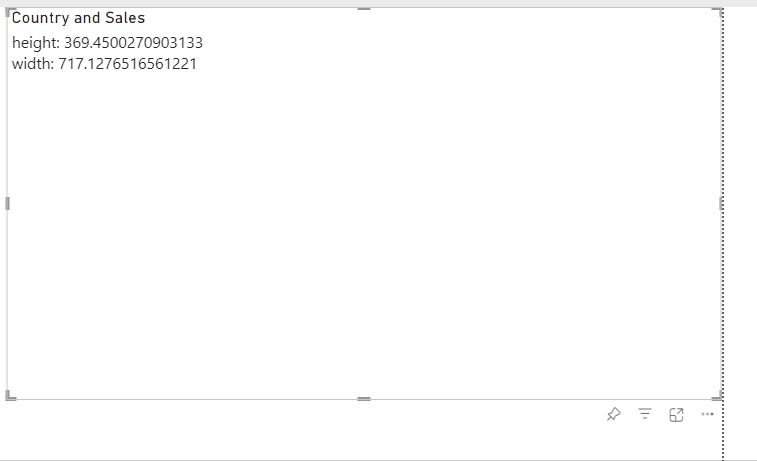

It's good to add some margins for each side of chart. Let's define constant for that

```html
{{ var 'margin' 30 }}
```

Then define rest of constants too

```html
<!-- SVG element width as svgWidth = viewport.width - margin -->
{{ var 'svgWidth' (sub viewport.width (val 'margin')) }}
<!-- SVG element height as svgHeight = viewport.height - margin -->
{{ var 'svgHeight' (sub viewport.height val 'margin') }}
<!-- Chart area group height as chartHeight = viewport.height - (margin * 3) -->
{{ var 'chartHeight' (sub viewport.height (multiply (val 'margin') 3) }}
<!-- Height of each bar as rectHeight = chartHeight / table.rows.length -->
{{ var 'rectHeight' (divide (val 'chartHeight') table.rows.length) }}
```

To bind data to HTML output use `table` object from context. Create two variables for each axes:

```html
<!-- Create array of sales values -->
{{ var 'sales' (map ' Sales' table.rows) }}
<!-- Create array of country names -->
{{ var 'countries' (map 'Country' table.rows) }}
```
Check the output to ensure map works correctly:

```html
<p>{{val 'countries'}}</p>
<p>{{val 'sales'}}</p>
``` 

should give output:

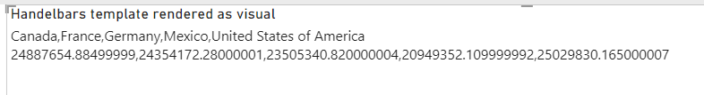

## Scales and axes

Variables are defined, time to create scales and axes.

### Scales

To define scales use next syntax:

```html
{{ scaleLinear 'Name of scale' [min_input, max_input] [0 svgWidth] }}
{{ scaleBand 'Name of scale' [categorical_values] [0, chartHeight]}}
```

Example for measure scale:
```html
{{ scaleLinear 'Scale X' (array ( min (val 'sales')) ( max (val 'sales'))) (array 0 (val 'svgWidth')) }}
```

where

* 'Scale X' is name
* `min (val 'sales')` returns minimum value of `sales` array defied above. 0 also can be used for display proportions correctly
* `max (val 'sales')` returns maximum value of `sales` array defied above.
* `(array ( min (val 'sales')) ( max (val 'sales')))` creates array with two elements, min and max values of Sales.
* `(array 0 (val 'svgWidth'))` creates array of two elements too, with 0 and 'svgWidth' variable value.


Example for categorical scale:
```html
{{ scaleBand 'Scale Y' (val 'countries') (array 0 (val 'chartHeight')) }}
```

where

* `(val 'countries')`is array of country names
* `(array 0 (val 'chartHeight')` is array of 0 and 'chartHeight' variable value

You can test scales output by using `useScale` function:

```html
<p>Germany: {{ useScale 'Scale Y' 'Germany' }}</p>
<p>Canada: {{ useScale 'Scale Y' 'Canada' }}</p>
<p>France: {{ useScale 'Scale Y' 'France' }}</p>
```

Scale should give correspond position value for each country name:

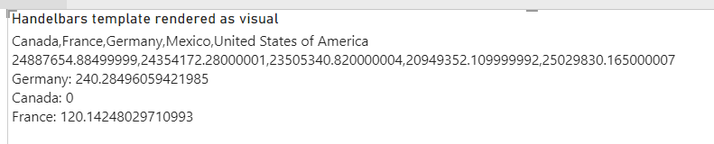

### Axes

Define two axes by using helper functions: `axisBottom` and `axisRight`:


```html
{{ axisBottom 'name' 'defined scale' }}
{{ axisRight 'name' 'defined scale' }}
```

Example:

```html
{{ axisBottom 'axisMeasure' 'Scale X' }}
{{ axisRight 'axisCategory' 'Scale Y' }}
```

'axisMeasure' uses 'Scale X' scale.
'axisCategory' uses 'Scale Y' scale.

Configure 'Scale Y' scale, set [inner](https://d3js.org/d3-scale/band#band_paddingInner) and [outer](https://d3js.org/d3-scale/band#band_paddingOuter) paddings:

```html
{{ setupScale 'Scale Y' 'paddingOuter' 0.2 }}
{{ setupScale 'Scale Y' 'paddingInner' 0.1 }}
```

Configure 'axisMeasure', set [ticks](https://d3js.org/d3-axis#axis_ticks) count and [tick format](https://d3js.org/d3-axis#axis_tickFormat):

```html
{{ setupAxis 'axisMeasure' 'tickFormat' '~s' }}
{{ setupAxis 'axisMeasure' 'ticks' 5 }}
```

## SVG template

### SVG element to render chart

To define SVG use `svg` tag in template:

```html
<svg width="100" height="100">

</svg>
```

It defines svg element of 100x100 size. To respond visual resizing use defined variables 'svgWidth' and 'svgHeight'

```html
<svg width="{{ val 'svgWidth' }}" height="{{ val 'svgHeight' }}">
    <!-- Add red rectangle with the same sizes to see output -->
    <rect  width="{{ val 'svgWidth' }}" height="{{ val 'svgHeight' }}" fill="red"/>
</svg>
```

After switching to `HTML/SVG/Handlebars` your should see red rectangle:

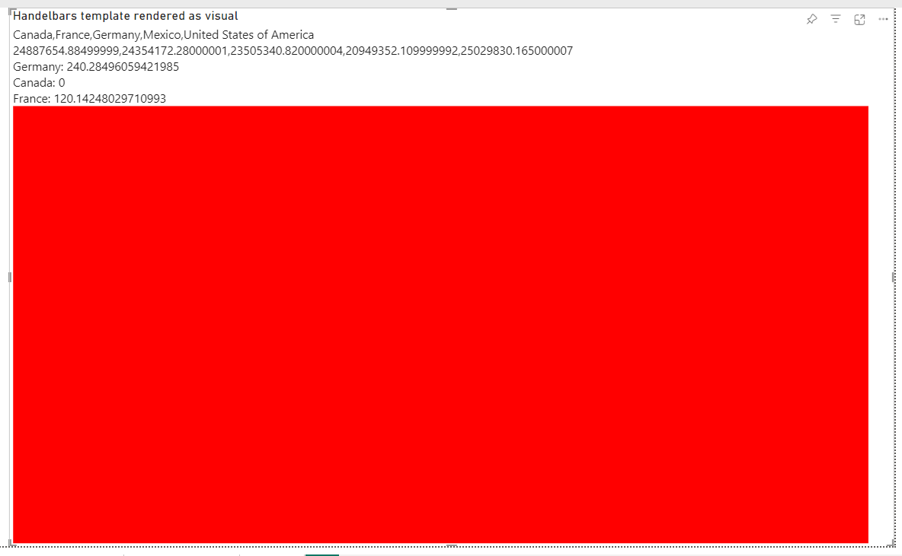

You can remove `p` elements used for testing.

### Bars

Add `g` ([grouping](https://developer.mozilla.org/en-US/docs/Web/SVG/Element/g)) element to group chart elements and set position.

```html
<svg width="{{ val 'svgWidth' }}" height="{{ val 'svgHeight' }}">
    <g transform="translate({{ val 'margin' }}, {{ val 'margin' }})">
        <rect  width="{{ val 'svgWidth' }}" height="{{ val 'svgHeight' }}" fill="red"/>
    </g>
</svg>
```

use [transform](https://developer.mozilla.org/en-US/docs/Web/SVG/Tutorial/Basic_Transformations#translation) attribute for shift group of elements to given position. We use 'margin' variable to add margins left and top sides.

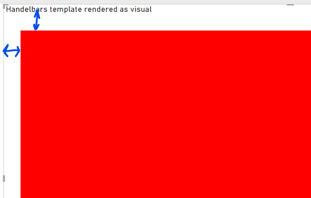

Create group and rectangles for each category (Country):

```html
<svg width="{{ val 'svgWidth'}}" height="{{ val 'svgHeight' }}">
    <g transform="translate({{ val 'margin' }}, {{ val 'margin' }})">
        <g>
            {{#each table.rows}}
            ...
            {{/each}}
        </g>
    </g>
</svg>
```

We use [`#each` build in block helper](https://handlebarsjs.com/guide/builtin-helpers.html#each), to iterate over table rows.

For each category create rectangle element: 
```html
<svg width="{{ val 'svgWidth' }}" height="{{ val 'svgHeight' }}">
    <g transform="translate({{ val 'margin' }}, {{ val 'margin' }})">
        <g>
            {{#each table.rows}}
            <rect
                x="0"
                y="{{{ useScale 'Scale Y' this.Country }}}"
                width="{{{ useScale 'Scale X' this.[ Sales] }}}"
                height="{{{ getScale 'Scale Y' 'bandwidth' }}}"
                fill="{{{ useColor this.Country }}}">    
            </rect>
            {{/each}}
        </g>
    </g>
</svg>
```

where

* 'x' is 0, we align rectangle to the left side.
* 'y' - vertical position depends on 'Scale X' scale value: '\{\{\{ useScale 'Scale Y' this.Country \}\}\}'. Use \{\{\{ \}\}\} to avoid HTML escaping. 
' this.' - reference to the current context of `each` block
* 'width' depends sales values, so use 'Scale X' scale to map scale values to SVG coordinates.
* 'height' - bind 'bandwidth' value from scale 'Scale Y' that depends on inner and outer paddings
* 'fill' - to bind color from Power BI palette, use `useColor` helper. It gives color for each given value (Country name)

Output if you used `min (val 'sales'))` for min value:

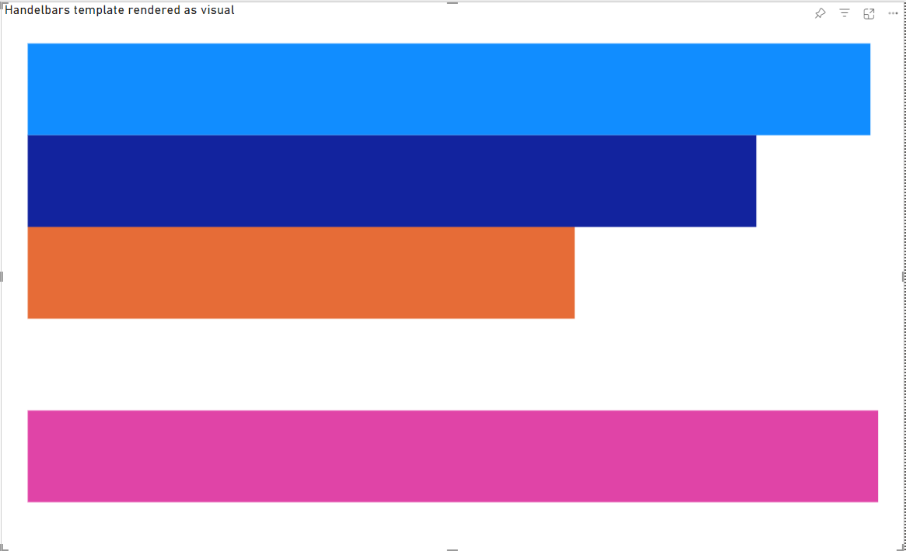

Output if you used 0 for min value:

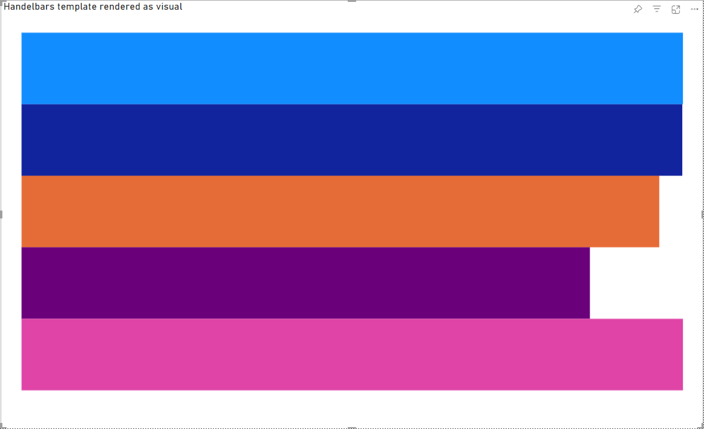

### Axes

The last step add axes renderings:

```html
    <g>
        {{{ useAxis 'axisMeasure' 'Scale X' }}}
    </g>
    <g>
        {{{ useAxis 'axisCategory' 'Scale Y' }}}
    </g>
```

Move measure axis to bottom (shift to chartHeight):

```html
    <g transform="translate(0, {{val 'chartHeight'}})">
        {{{ useAxis 'axisMeasure' 'Scale X' }}}
    </g>
    <g>
        {{{ useAxis 'axisCategory' 'Scale Y' }}}
    </g>
```

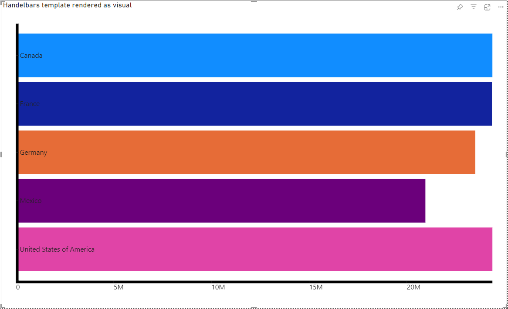


Add styles for axes ticks:

```html
<style>
    .tick text {
        font-size: 20px;
        font-weight: 700;
    }
</style>
```

To set proper sizes

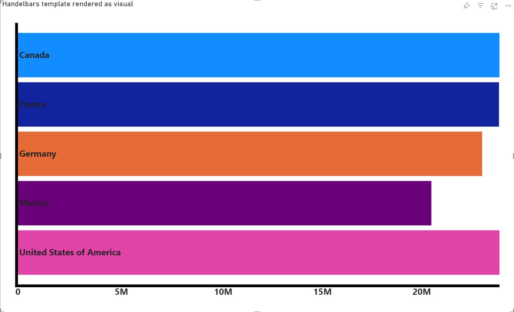

### Interactivity

Add selections support:

The HTML/SVG/Handlebars Visual supports interactivity:

To handle click on background element for clear selection add `\{\{\{ useSelectionClear \}\}\}` to SVG element

```html
<svg width="{{ val 'width' }}" height="{{ val 'height' }}" {{{ useSelectionClear }}}>
```

Add `{{{ useSelection @index}}}` to each rectangle element to handle click on bars for selection:

```html
<rect
    {{{ useSelection @index}}}
    x="0"
    y="{{{ useScale 'Scale Y' this.Country }}}"
    width="{{{ useScale 'Scale X' this.[ Sales] }}}"
    height="{{{ getScale 'Scale Y' 'bandwidth' }}}"
    fill="{{{ useColor this.Country }}}">    
</rect>
```

It adds data attributes for selected (data-selection="true") and unselected (data-selection="false") elements. Add styles to visualize selections:

```css
[data-selection="false"] {
    opacity: 0.5
}
```

The final result:

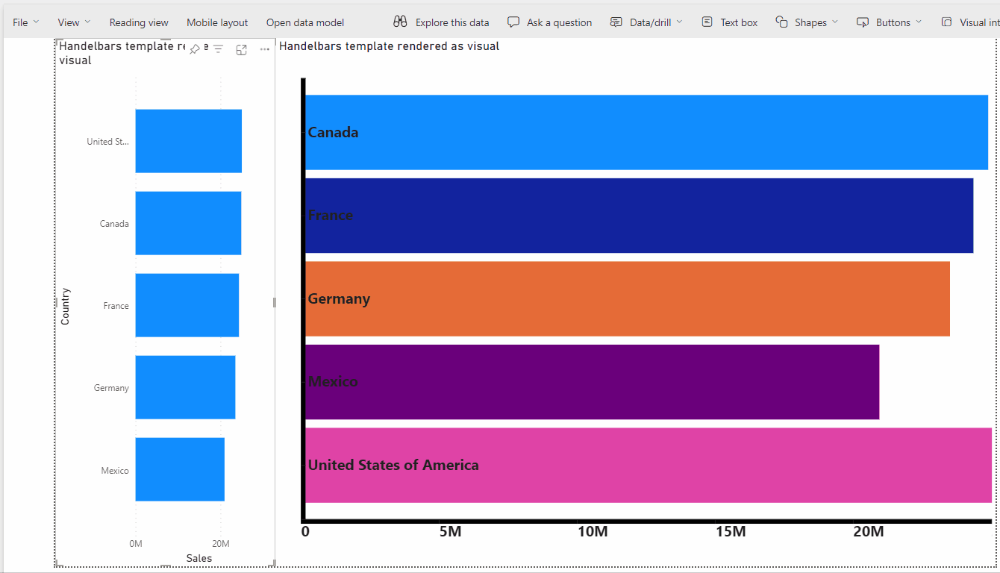

Full template:

```html
{{ var 'margin' 30}}
{{ var 'svgHeight' (sub viewport.height (val 'margin')) }}
{{ var 'chartHeight' (sub viewport.height 90) }}
{{ var 'svgWidth' (sub viewport.width 30) }}
{{ var 'rectHeight' (divide (val 'chartHeight') table.rows.length) }}
{{ var 'countries' (map 'Country' table.rows) }}
{{ var 'sales' (map ' Sales' table.rows) }}
{{ scaleLinear 'Scale X' (array 0 ( max (val 'sales'))) (array 0 (val 'svgWidth'))}}
{{ scaleBand 'Scale Y' (val 'countries') (array 0 (val 'chartHeight'))}}
{{ axisBottom 'axisMeasure' 'Scale X' }}
{{ axisRight 'axisCategory' 'Scale Y' }}
{{ setupScale 'Scale Y' 'paddingOuter' 0.2 }}
{{ setupScale 'Scale Y' 'paddingInner' 0.1 }}
{{ setupAxis 'axisMeasure' 'tickFormat' '~s' }}
{{ setupAxis 'axisMeasure' 'ticks' 5 }}
<svg width="{{ val 'width'}}" height="{{ val 'height' }}" {{{ useSelectionClear }}}>
    <g transform="translate({{ val 'margin'}}, {{ val 'margin'}})">
        <g>
            {{#each table.rows}}
            <rect
                {{{ useSelection @index}}}
                x="0"
                y="{{{ useScale 'Scale Y' this.Country }}}"
                width="{{{ useScale 'Scale X' this.[ Sales] }}}"
                height="{{{ getScale 'Scale Y' 'bandwidth' }}}"
                fill="{{{ useColor this.Country }}}">    
            </rect>
            {{/each}}
        </g>
        <g transform="translate(0, {{ val 'chartHeight' }})">
            {{{ useAxis 'axisMeasure' 'Scale X' }}}
        </g>
        <g transform="translate(0, 0)">
            {{{ useAxis 'axisCategory' 'Scale Y' }}}
        </g>
    </g>
</svg>
<style>
    .tick text {
        font-size: 20px;
        font-weight: 700;
    }
    [data-selection="false"] {
        opacity: 0.5
    }
</style>
```


