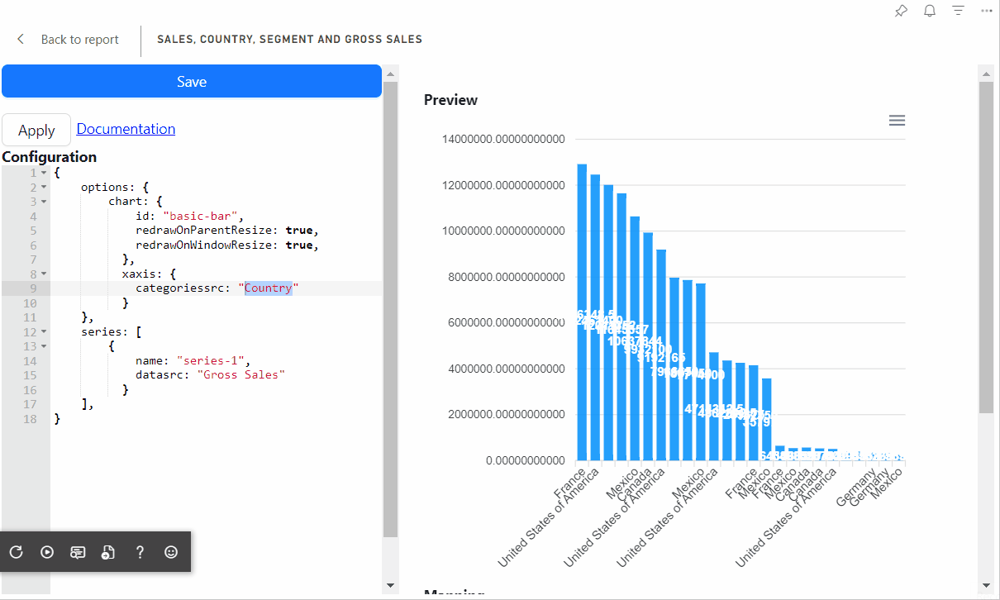

# Visual documentations

All visuals in development phase

## Power BI Visual Editor

The Visual allows you to edit JSON schemas of Deneb, PlotlyJS, HTML/SVG/Handlebars Visual and Charticulator visualizations.

<iframe width="560" height="315" src="https://www.youtube.com/embed/6hYdS2tPx1A?si=hU-_WewFD3a3Dbjm" title="YouTube video player" frameborder="0" allow="accelerometer; autoplay; clipboard-write; encrypted-media; gyroscope; picture-in-picture; web-share" allowfullscreen></iframe>

[Power BI Visual Editor (AppSource)](https://appsource.microsoft.com/en-US/product/PowerBIVisuals/ilfatgaliev1696579877540.editorvisual)

[Read more about Power BI Visual Editor](/docs/visual-editor/)

## HTML/SVG/Handlebars Visual

The visual allows the use of HTML and SVG to layout content in Power BI reports using data from Power BI.

<iframe width="560" height="315" src="https://www.youtube.com/embed/QpSfZvts_FE?si=OO9C4UXp3G4g2rMw" title="YouTube video player" frameborder="0" allow="accelerometer; autoplay; clipboard-write; encrypted-media; gyroscope; picture-in-picture; web-share" allowfullscreen></iframe>

[Read more about HTML/SVG/Handlebars Visual](/docs/handelbars-visual/)

## Apache ECharts Visual

The visual integrates the ECharts into Power BI visual. Apache ECharts is an Open Source JavaScript Visualization Library.

### Flexible Chart Types

Apache ECharts provides more than 20 chart types available out of the box, along with a dozen components, and each of them can be arbitrarily combined to use.

### Powerful Rendering Engine

Easily switch between Canvas and SVG rendering. Progressive rendering and stream loading make it possible to render 10 million data in realtime.

<iframe width="560" height="315" src="https://www.youtube.com/embed/OIcs0mSlTnk?si=-L-pzDVE0zZZTOxF" title="YouTube video player" frameborder="0" allow="accelerometer; autoplay; clipboard-write; encrypted-media; gyroscope; picture-in-picture; web-share" referrerpolicy="strict-origin-when-cross-origin" allowfullscreen></iframe>

[Read more about Apache ECharts Visual](/docs/echarts-visual/)

### ApexCharts Visual

ApexCharts is a modern charting library that helps developers to create beautiful and interactive visualizations for web pages.

It is an open-source project licensed under MIT and is free to use in commercial applications.

Coming soon...