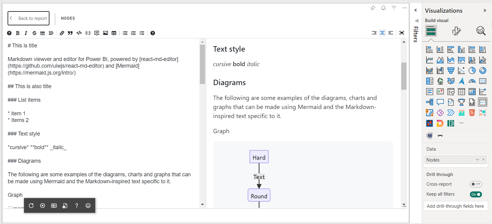
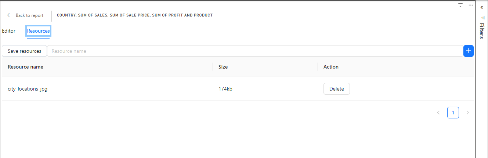
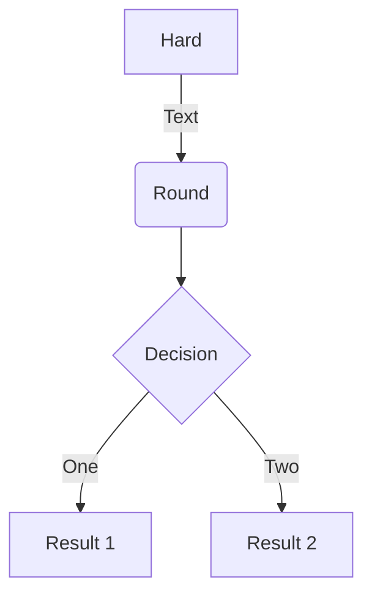
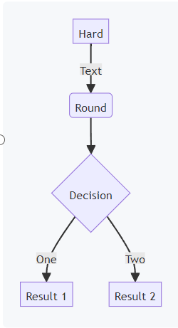
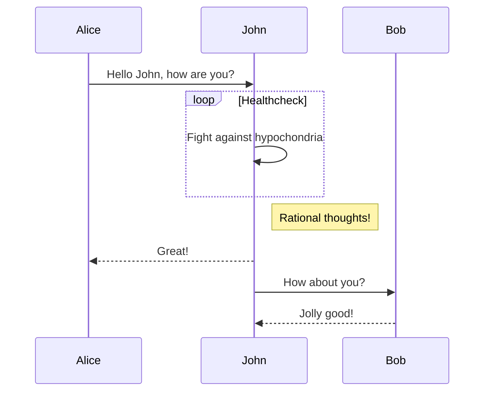
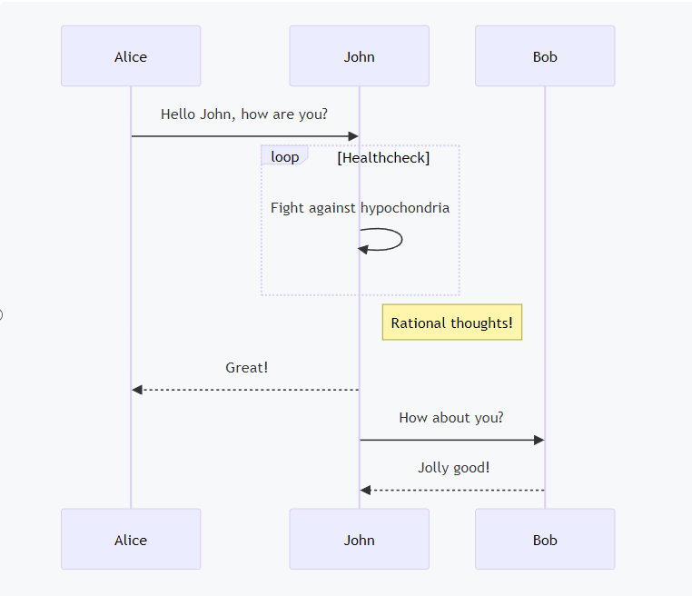
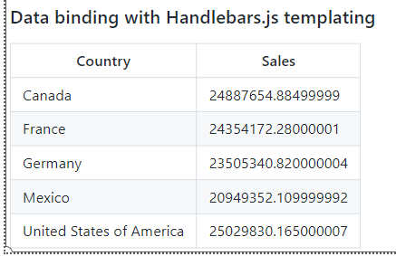

# Markdown & Mermaid Visual



Markdown viewer and editor for Power BI, powered by [react-md-editor](https://github.com/uiwjs/react-md-editor) and [Mermaid.js](https://mermaid.js.org/intro/)

The visual supports most of features described in [Markdown documentation](https://www.markdownguide.org/basic-syntax/).

## What is markdown markup language?

Markdown is a lightweight markup language for creating formatted text using a plain-text editor. John Gruber created Markdown in 2004 as an easy to read markup language.[9] Markdown is widely used for blogging and instant messaging, and also used elsewhere in online forums, collaborative software, documentation pages, and readme files.

Source: [en.wikipedia.org](https://en.wikipedia.org/wiki/Markdown)

## Edit this source

To edit the source of this text, click on "Edit" menu item in visual menu.

After editing click on "Save" button and "Back to report" to exit from edit mode.

### List items

* item 1
* Items 2

### Text style

*cursive* **bold** _italic_

### Images

To use images in markdown, upload the images in `Resources` tab. Click `+` button to select file.



Then click on `Save resources` button.

After that use resource name in URL part of image syntax:

``

### Diagrams

The following are some examples of the diagrams, charts and graphs that can be made using Mermaid and the Markdown-inspired text specific to it. 

Read more about Mermaid in [official documentation](https://mermaid.js.org/intro/)

Graph

```


Result:



Sequence diagram

```


Result:



### Tables

| Syntax      | Description |
| ----------- | ----------- |
| Header      | Title       |
| Paragraph   | Text        |

### Code Blocks

*Node: Syntax highlighting only works in view mode*

json

```json
{
  "firstName": "John",
  "lastName": "Smith",
  "age": 25
}
```

C#

```csharp
using System;

namespace HelloWorld
{
  class Program
  {
    static void Main(string[] args)
    {
      Console.WriteLine("Hello World!");    
    }
  }
}
```

SQL

```sql
SELECT * FROM Customers;
```

### Task list

- [x] Write the press release
- [ ] Update the website
- [ ] Contact the media

### Data binding with Handlebars.js template

```
| Country | Sales |
| ----------- | ----------- |
{{#each table.rows}}
| {{ this.Country }}| {{ this.[Sum of  Sales] }} |
{{/each}}
```

Result:


